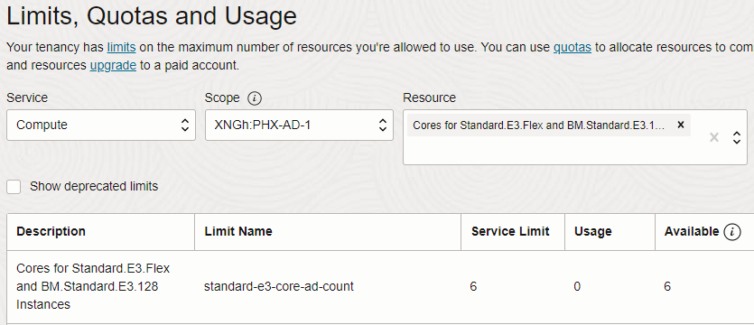
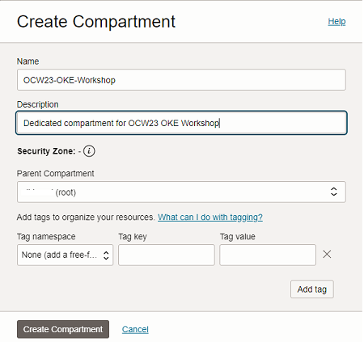
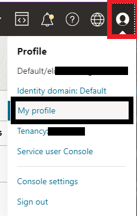
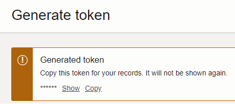

# Prepare your tenancy

## Introduction

In this lab you'll provision a couple of requisite resources, familiarize yourself with some of the console features (if not already), and validate resource availability. If using a brand new tenancy, you will have sufficient capacity to complete the entire workshop.

Estimated time: 15 minutes

### Objectives

* Ensure sufficient capacity is available to complete all labs 
* Generate Auth token
* Create new Compartment

## Task 1: Validate resource quotas / availability

1. Log into your OCI tenancy (if not already) and use the hamburger menu to navigate to **`Governance & Administration`** -> **`Limits, Quotas and Usage`**
2. The initial display will show Compute service limits. Select **AD-1** for Scope, then click the **[Resource]** drop down and type *cores for standard.e3*. Select the first result. Check the **Available** column to ensure you have at least 3 cores available.

    

3. Clear the **[Resource]** filter and type *Memory for standard.e3.flex* then select eh first result. Ensure you have at least 48GB available. (you'll allocate 16GB per node in your cluster)

## Task 2: Create a new compartment for the workshop

1. Navigate to **`Identity and Security`** -> **`Compartments`**.

2. Click **`[Create Compartment]`**, then provide a **Name** and **Description**. **Parent Compartment** should be *(root)*.

    

3. Click **[`Create Compartment`]** to provision the resource.

4. Once the Compartment in task 2 has been created, it will appear in the list of compartments.

5. Locate the **OCID** column for the compartment you just created. Hover over the partially displayed OCID and click the *Copy* link.  Store the value in a text file for later use.

    

## Task 3: Create an Auth Token

1. Click the profile avatar in the top right corner of the console and select **My profile**

    

2. Scroll down to the **Resources** Menu on the left side and view the available options. This is where you would create API Keys (for CLI, Terraform, SDK access) and Auth Tokens (i.e. access to OCI Container Registry).

3. Click **Auth tokens**

4. Click **`[Generate token]`**, provide a description (i.e. *oke-workshop*), and click **`[Generate token]`** once more.

5. The generated token will be displayed. Click the *Copy* link and paste the value into a text file for use later.

    

    >Note: As the dialog says, if you don't save it now, you won't be able to see the token after closing the window.

## Task 4: Retrieve the Object storage namespace for your tenancy

1. Click the profile avatar in the top right corner once again and select **Tenancy: <your tenancy name>**

2. Locate the **Object storage namespace** item and copy the value. It is a 12-digit value.

You may now **proceed to the next lab**.

## Acknowledgements

* **Author** - 
* **Contributors** -
* **Last Updated By/Date** -