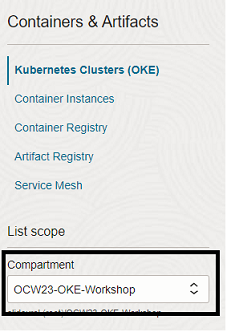
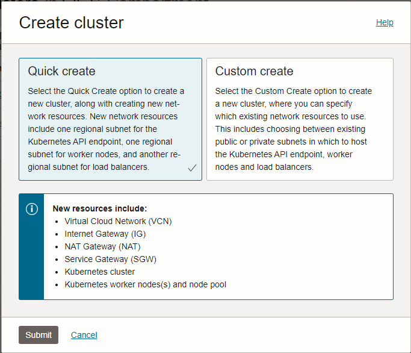
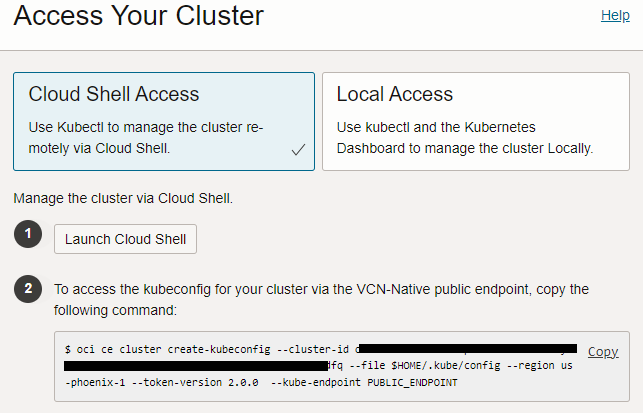
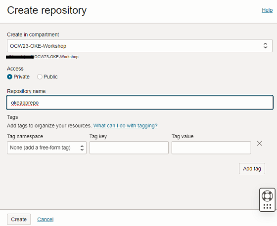

# Provision the OKE cluster and Virtual Cloud Network

## Introduction

In this lab you will leverage the **Quick create** feature to deploy a new OKE cluster along with all requisite virtual network resources. A couple of clicks is all it takes! You'll also create an OCI Container Registry repo and configure a Kubernetes secret.

Estimated time: 30 minutes

### Objectives

* Deploy an OKE cluster
* Create a container image repo in OCIR
* Register a new Kubernetes secret for authentication to OCIR

## Task 1: Provision an OKE Cluster

1. Navigate to **`Developer Services`** -> **`Kubernetes Clusters (OKE)`**

2. Ensure the workshop compartment has been selected under **List scope** in the left nav bar.

    

3. Click **`[Create cluster]`**, choose **Quick create**, and click **`[Submit]`**.

    

4. Provide a name for your cluster (no spaces).

5. Assign the following settings:
    1. Kubernetes version: *v1.26.2*
        This is not the latest version. This is intentional. This is the way.
    2. Kubernetes API Endpoint: *Public endpoint*
    3. Node Type: *Managed*
    4. Kubernetes worker nodes: *Private workers*
    5. Shape and image:
        1. Pod shape: *VM.Standard.E3.Flex*
        2. Nmber of OCPUs: *1*
        3. Amount of memory (GB): *16*
    6. Image: *Oracle Linux 7.9* (default)
    7. Node count: *2*
        *You'll add more later*

6. Click **`[Next]`**

7. Confirm the resources to be created and click **`[Create cluster]`**

8. The cluster and associated network resources will begin creating. You can close the dialog page.

9. Feel free to explore the UI a bit, the cluster will take a short while to create.  Do not proceed until the large hexagon turns green.

## Task 2: Retrieve Kubeconfig and set up some shortcuts

1. Click **`Access Cluster`** and then *copy* the command found in the second step.

    

2. Open Cloud Shell

    

3. Paste and run the command. This will return the message: *New config written to the Kubeconfig file in `<your home directory>/.kube/config`

4. And finally...let's make life a little easier by reducing the amount of typing required.  If you'd like, go ahead and:

    1. Create an alias for the **`kubectl`** command.

        ```
        <copy>alias k=kubectl</copy>
        ```

    2. Create an alias for **`kubectl get`**

        ```
        <copy>alias kg='kubectl get'</copy>
        ```

    3. Create an alias for **`kubectl delete`** (in this case we use *rm* to emulate the bash shell)

        ```
        <copy>alias krm='kubectl delete'</copy>
        ```

**NOTE:** During the remainder of the workshop, `kubectl` commands will be typed out in full. If you opted to create aliases, don't forget to use them.

## Task 3: Get to know your OKE cluster

Now that Kubernetes is up and running, interacting with the cluster is pretty much the same as if you were running Kubernetes on your own equipment. Let's take a look at some of the resources that get created as part of the initial setup.

1. First and foremost, what do we know about our new OKE cluster? Type `kubectl cluster-info` to find out!

2. Take a look at the default set of namespaces with `kubectl get namespaces`. You should see *default*, *kube-node-lease*, *kube-public*, and *kube-system*.

3. Check to see which pods are running across all namespaces with `kubectl get pods -o wide -A`. You should see the likes of coredns, flannel, kube-proxy, and more.

4. Are there any ingress resources defined? Try `kubectl get ingress -A` - the results should be empty as we've not yet deployed an ingress controller or defined any ingress resources.  

5. Minimize (but do not exit) Cloud Shell.

## Task 4: Create a Container Registry Repo

The OCI Container Registry (OCIR) is a secure, Dockerhub-compliant service that enables you to store and manage your container iamges securely, within the confines of OCI. 

<details><summary><b>Prefer to work with the CLI?</b></summary>

The instructions below will take you through creating a new repo via the Web UI. If you'd prefer to create the repo using the OCI CLI, you may remain in Cloud Shell and run this command (make sure to adjust the parameter value to reflect your own compartment OCID).

    ```bash
    <copy>
	oci artifacts container repository create --compartment-id ocid1.compartment.oc1..aaaaaaaace...... --display-name okeapprepo
    </copy>
    ```

---
</details>

1. Navigate to **`Developer Services`** -> **`Container Registry`**

2. Click **Create repository**

3. Provide a name for your repo and ensure it is set to **Private** access.

    

4. Click **`[Create]`**

## Task 5: Register a secret in Kubernetes

1. First things first - you'll need to locate the region key for your selected region. This will be used to connect to the apprpriate Container Registry Endpoint. Return to Cloud Shell and enter the following command:

    ```
    <copy>
    oci iam region list --query 'data[?name == `us-phoenix-1`].key'
    </copy>
    ```

    >NOTE: if not using Phoenix, replace the region name with that which you've selected for the workshop.

2. Your Container Register endpoint will thus be the **key** plus `.ocir.io`. *i.e.* `phx.ocir.io`

3. For this next command you'll need to retrieve your Auth token which was created in the first lab. Construct the following command, making sure to input your own details:

    ```
    <copy>
    kubectl create secret docker-registry ocirsecret --docker-server=<container registry endpoint> --docker-username=<complete username> --docker-password=<auth token> --docker-email=<your email address>
    <copy>
    ```
    
    * container registry endpoint = i.e. phx.ocir.io
    * complete username = `<tenancy namespace>/<username or email address>`
        *i.e. abc123dev456/eli.schilling@oracle.com*
    * auth token = the value of the token created in lab 1

4. Validate that the secret was created successfully:

    ```
    <copy>
    kubectl get secrets
    <copy>
    ```

    ```
    user123@cloudshell:~ (us-phoenix-1)$ kubectl get secrets
    NAME         TYPE                             DATA   AGE
    ocirsecret   kubernetes.io/dockerconfigjson   1       3m
    ```


You may now **proceed to the next lab**.

## Learn More

* [Oracle Container Engine for Kubernetes (OKE)](https://www.oracle.com/cloud/cloud-native/container-engine-kubernetes/)


## Acknowledgements

* **Author** - 
* **Contributors** -
* **Last Updated By/Date** -