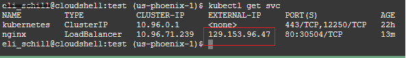
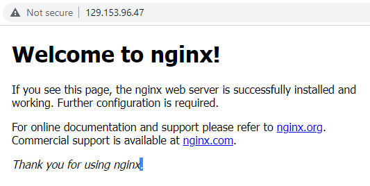
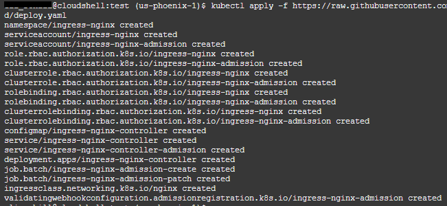
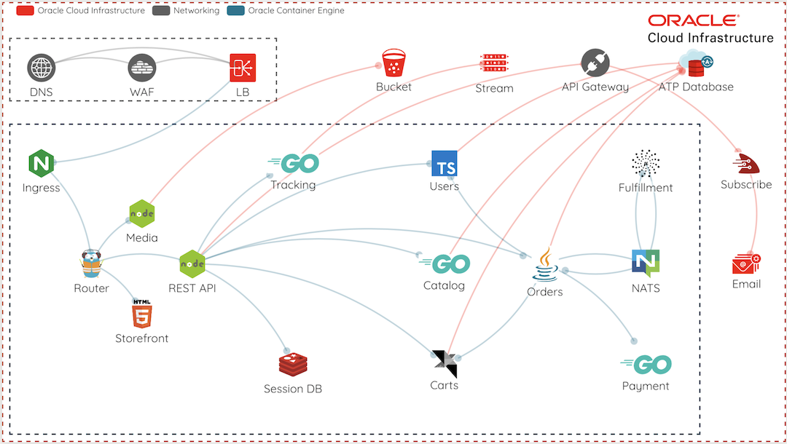
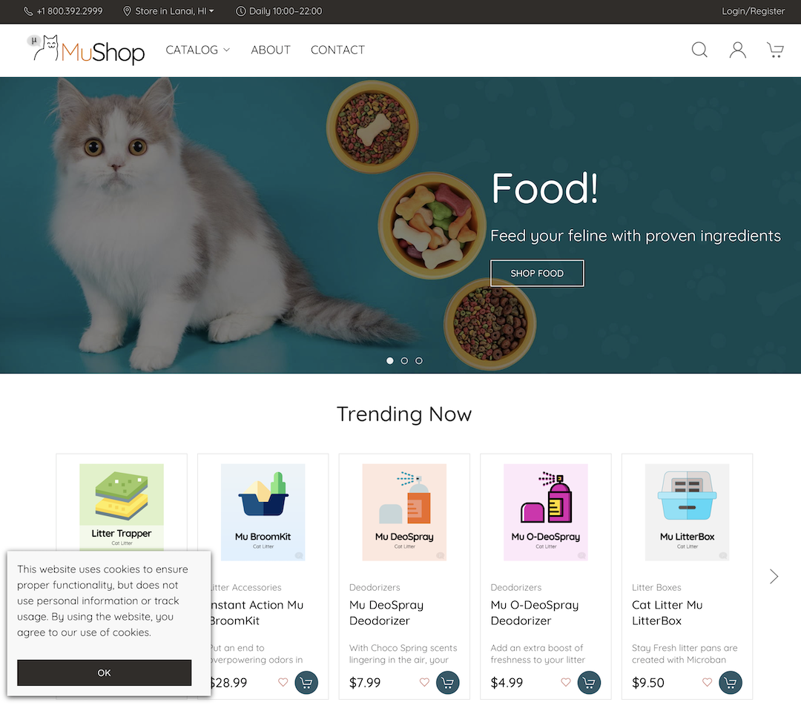

# Deploying your first application to OKE

## Introduction

In this lab you'll deploy a few different resources and get to know how Kubernetes operates on OCI. If you've already deployed Kubernetes yourself in another environment, you'll find it functions pretty much the same -- only without all the effort required to actually deploy and manage the cluster.

Estimated time: 30 minutes

### Objectives

* Deploy a sample app and expose it to the internet using an OCI Load Balancer
* Deploy an nginx Ingress controller
* Deploy a second application and expose it to the internet via the Ingress controller

## Task 1: Deploy nginx and corresponding load balancer.

1. From Cloud Shell, run the following command:

    ```bash
    <copy>
    kubectl run nginx --image=nginx
    </copy>
    ```

2. Use `kubectl get pods` to check status of the pod creation.

3. Create a service to expose the application. The cluster is integrated with OCI Cloud Conroller Manager (CCM). As a result, creating a service of type `--type=LoadBalancer` will expose the pod to the internet using an OCI Load Balancer. Run the following command:

    ```bash
    <copy>
    kubectl expose pod nginx --port=80 --type=LoadBalancer
    </copy>
    ```

4. You may choose to minimize Cloud Shell and navigate to **Networking** -> **Load Balancers** in the Cloud Console to watch the resource create. Otherwise, run the following command to check status:

    ```bash
    <copy>
    kubectl get svc
    </copy>
    ```

5. It may take a minute or two to complete. But when it does, you'll see the public IP address of the Load Balancer. Copy that into a new browser tab to check your work.

    

    

6. Remove the resources to clean up before proceeding to the next task.

    ```bash
    <copy>
    kubectl delete svc nginx
    kubectl delete pod nginx
    </copy>
    ```

## Task 2: Deploy the *ingress-nginx* Controller

The `ingress-nginx` controller is built and mainained as part of the Kubernetes project. Deploying it to your cluster is as simple as running a single command. After that, we'll dive into how to configure and use the controller.

1. Run the following command:

    ```bash
    <copy>
    kubectl apply -f https://raw.githubusercontent.com/kubernetes/ingress-nginx/controller-v1.8.0/deploy/static/provider/cloud/deploy.yaml
    </copy>
    ```

    

2. You can see it creates a number of resources including a new namespace, service accounts, RBAC settings, and more.  Check the services created in the new namespace `ingress-nginx`.

    ```bash
    <copy>
    kubectl -n ingress-nginx get svc -o wide ingress-nginx-controller
    </copy>
    ```

3. Jot down that external IP address.  You'll likely use it quite a bit throughout the rest of the workshop.  You can also set an environment variable if you'd like (replace *`<External IP>`* with the one you just noted).

    ```bash
    <copy>
    export EXTERNAL_IP=<your external IP here>
    </copy>
    ```

*Notice* that it created a service type of Load Balancer with a public IP address? While it's great to be able to easily expose a single deployment with a Load Balancer, that may not give you the best control over your resource utilization. With the ingress controller, we send all inbound traffic to a single Load Balancer and tell nginx how to distribute that traffic within our OKE cluster.

## Task 3: Deploy another app and configure ingress

The first deployment was just a basic example that allowed us to quickly spin up an app and see what it looks like to connect to our cluster over the internet. For the rest of the workshop we'll use something a bit more complex.

[MuShop](https://oracle-quickstart.github.io/oci-cloudnative/cloud/) is a microservices demo application *purpose-built* to showcase interoperable **Cloud Native** services on **Oracle Cloud Infrastructure**, and to demonstrate a number of cloud-native methodologies. While the complete deployment leverages a wide variety of services, we'll be deploying a simple version of the application to maintain a focus on OKE.

   

1. Retrieve the `resources.zip` file that contains the HELM charts for deploying MuShop:

    ```bash
    <copy>
    wget https://objectstorage.us-phoenix-1.oraclecloud.com/p/MAj3VdS04Rgw-qoetUpw6UJfeXJJk-Sz7qCBiVboBn-q4aDKwGJdIzVyhQY4KTgt/n/axhc9zgtyjst/b/workshop/o/resources.zip
    </copy>
    ```

2. Unzip the files and open the containing directory:

    ```bash
    <copy>unzip resources.zip && cd resources</copy>
    ```

3. View the contents of the Mushop directory:

    ```bash
    <copy>ls -al mushop</copy>
    ```

4. Remembering that Helm provides a way of packaging and deploying configurable charts. Next we will deploy the application in "mock mode," where cloud services are mocked, yet the application is fully functional:

    ```bash
    <copy>
    helm upgrade --install mushop ./mushop -f ./mushop/values-workshop.yaml
    </copy>
    ```

5. It may take a few minutes to download and run all the application images. You can run the following to observe:

    ```bash
    <copy>kubectl get pods --watch</copy>
    ```

    > Note: To leave the `watch` press <kbd>CTRL-C</kbd> anytime. If do not want to keep watching and just see the current list of PODS, just use `kubectl get pods`.

6. Make sure all the pods are in the `Running` (or completed) state:

    ```bash
    <copy>kubectl get pods</copy>
    ```

    Sample response:

    ```console
    NAME                                  READY   STATUS      RESTARTS   AGE
    mushop-api-6cbb9957fc-smmqf           1/1     Running     0          3m3s
    mushop-assets-687c574c68-r2wf6        1/1     Running     0          3m3s
    mushop-assets-deploy-1-kbnj5          0/1     Completed   0          3m3s
    mushop-edge-645bc886c7-8m52n          1/1     Running     0          3m3s
    mushop-fulfillment-76f98cddbb-vnp6h   1/1     Running     0          3m2s
    mushop-session-67bc86d446-jnq8w       1/1     Running     0          3m3s
    mushop-storefront-5747bd4644-tdn4v    1/1     Running     0          3m3s
    ```

7. Open the MuShop storefront with your browser by connecting to `http://<EXTERNAL-IP>`:

    

## Task 4: Explore the deployed app

When you create a Deployment, you'll need to specify the container image for your application and the number of replicas that you want to run.

Kubernetes creates a Pod to host your application instance. A Pod is a Kubernetes abstraction that represents a group of one or more application containers (such as Docker), and some shared resources for those containers. Those resources include:

* Shared storage, as Volumes
* Networking, as a unique cluster IP address
* Information about how to run each container, such as the container image version or specific ports to use

The most common operations can be done with the following kubectl commands:

* **kubectl get** -- list resources
* **kubectl describe** -- show detailed information about a resource
* **kubectl logs** -- print the logs from a container in a pod
* **kubectl exec** -- execute a command on a container in a pod

You can use these commands to see when applications were deployed, what their current statuses are, where they are running, and what their configurations are.

1. Check the microservices deployments for MuShop:

    ````bash
    <copy>
    kubectl get deployments
    </copy>
    ````

2. Check the pods deployed:

    ````bash
    <copy>
    kubectl get pods
    </copy>
    ````

3. Get the last created pod to inspect:

    ````bash
    <copy>
    export POD_NAME=$(kubectl get pods -o go-template \
     --template '{{range .items}}{{.metadata.name}}{{"\n"}}{{end}}'|awk '{print $1}'|tail -n 1) && \
    echo Using Pod: $POD_NAME
    </copy>
    ````

4. View what containers are inside that Pod and what images are used to build those containers:

    ````bash
    <copy>
    kubectl describe pod $POD_NAME
    </copy>
    ````

5. Anything that the application would normally send to `STDOUT` becomes logs for the container within the Pod. We can retrieve these logs using the `kubectl logs` command:

    ````bash
    <copy>
    kubectl logs $POD_NAME
    </copy>
    ````

6. Execute commands directly on the container once the Pod is up and running:

    ````bash
    <copy>
    kubectl exec -it $POD_NAME -- env
    </copy>
    ````

7. List the content of the Pod's container work folder:

    ````bash
    <copy>
    kubectl exec -ti $POD_NAME -- ls
    </copy>
    ````

    > **Note:** You can also start a `bash` session on the Pod's container, just change the `ls` to `bash`. Remember that you need to type `exit` to exit the bash session.


You may now **proceed to the next lab**.

## Learn More

* [MuShop Github Repo](https://github.com/oracle-quickstart/oci-cloudnative)
* [MuShop Deployment documentation](https://oracle-quickstart.github.io/oci-cloudnative/cloud/)

## Acknowledgements

* **Author** - Oracle
* **Contributors** - Adao Oliveira Junior (Solutions Architect), Eli Schilling (Developer Advocate)
* **Last Updated By/Date** - Eli Schilling, August 2023
