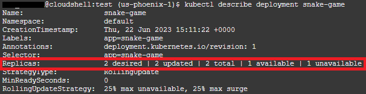

# Working with Virtual Nodes

## Introduction

OKE virtual nodes deliver a complete serverless Kubernetes experience. With virtual nodes, you can ensure reliable operations of Kubernetes at scale without needing to manage any worker node infrastructure. This cluster option provides granular pod-level elasticity and pay-per-pod pricing, while eliminating the operational overhead of managing, scaling, upgrading, and troubleshooting worker nodes’ infrastructure. Kubernetes clusters become fully managed. Oracle manages clusters’ control plane and data plane for you. You’re responsible only for the applications deployed through the cluster’s Kubernetes API.

Estimated time: 20 minutes

### Objectives

In this lab you will deploy a second OKE cluster that utilizes Virtual Nodes, a feature that precludes any need to manage underlying compute infrastructure for your worker node pools. 

## Task 1: Deploy New OKE Cluster
In this task you will deploy a new OKE cluster using Resource Manager and Terraform. All of the code is built and ready to go...you just need to click a few buttons to get it done.

1. Click the following link to deploy a new OKE Cluster with Virtual Nodes.

    [](https://cloud.oracle.com/resourcemanager/stacks/create?zipUrl=https://github.com/oracle-devrel/terraform-oci-arch-oke-virtual-node/archive/refs/tags/terraform-virtual-nodes-security-list-v5.zip)

2. The link will open the OCI Resource Manager console (you might be prompted to log in) and pre-populate with the template info.

    

3. You'll need to click the check box indicating acceptance for Oracle's T's and C's. Then click **`next`**.

4. Fill in the available options when selected.
    1. Compartment - Where you'd like the resources to be created. Use `root` if you did not created a separate compartment for this workshop during lab 1.
    2. Region - The region in which the resources will be created. This should be your home region.
    3. You may leave the items under **OKE Inputs** all as default.
    4. Check the box for *Ingress Controller*.

    

5. Click **`next`**

6. Validate the *Stack Information*, ensure the *Run apply* checkbox is checked, and click **`create`**.

7. Observe the job logs while the resources are created. You may move on to task 2 while this completes. 

## Task 2: Create a custom Docker image and push to OCIR

1. In Cloud Shell, return to the Resources directory that was leveraged in Lab 3.

  ```<copy>cd ~/resources</copy>```

2. Run the `docker login` command to authenticate to the Container Registry.  You'll need the username and password (auth toke) captured during lab 1.

  ```<copy>
  docker login phx.ocir.io
  </copy>
  ```

  >Note: Replace `phx` with the region key for your chosen region

  ```shell
  eli_devrel@cloudshell:resources (us-phoenix-1)$ docker login phx.ocir.io
  Username (abc123def456/eli.devrel@gmail.com): abc123def456/eli.devrel@gmail.com
  Password: 
  WARNING! Your password will be stored unencrypted in /home/eli_devrel/.docker/config.json.
  Configure a credential helper to remove this warning. See
  https://docs.docker.com/engine/reference/commandline/login/#credentials-store

  Login Succeeded
  ```

3. Now its time to build:

  ```
  <copy>
  docker build . -t sample-app
  </copy>
  ```

4. ...and tag the Docker image.

  ```
  <copy>
  docker tag sample-app:latest phx.ocir.io/<tenancy namespace>/<repo-name>:version
  </copy>
  ```

  For example: `docker tag sample-app:latest phx.ocir.io/abc123def456/okeapprepo:latest`

  >Note: Because the Container Registry is Dockerhub compliant, it is not inherently aware of OCI Compartments. When tagging your image, we associate the repo name as the container image `okeapprepo` so Container Registry knows where to place the bits. If you alter the name or append additional characters, OCIR will attempt to create a new repo in the root directory to match the name.

5. If you now run `docker images` you'll see a new copy of that image with the corresponding tag.

6. Now you can push the image to the Container Registry (be sure to use the correct image tag based on what you created):

  ```
  <copy>
  docker push phx.ocir.io/abc123def456/okeapprepo:latest
  <copy>
  ```

7. Once the push is complete, you can minimize Cloud Shell and return to the Container Registry UI to verify the image was placed correctly.

  

## Task 3: Create the Kubernetes manifest files

1. Open Code Editor from the OCI Console.

    

2. Click **File** -> **New File** from the menu.

3. Name the file `sample-app-dep.yaml`

4. Paste the following code block:

    ```
    <copy>
    apiVersion: apps/v1
    kind: Deployment
    metadata:
      name: snake-game
      labels:
        app: snake-game
    spec:
      selector:
        matchLabels:
          app: snake-game
      replicas: 1
      template:
        metadata:
          labels:
            app: snake-game
        spec:
          containers:
          - name: snake
            image: phx.ocir.io/axhc9zgtyjst/okeapprepo:latest
            ports:
            - containerPort: 8080
          imagePullSecrets:
          - name: ocirsecret
    ---
    apiVersion: v1
    kind: Service
    metadata:
      name: snake-game-svc
    spec:
      selector:
        app: snake-game
      ports:
        - port: 8089
          targetPort: 8080
      type: ClusterIP
    </copy>
    ```
5. Click **File** -> **Save** to save your changes.

6. Create a second file using the menu. Name it `sample-app-ingress.yaml`.

7. Paste the following code block:

    ```
    <copy>
    apiVersion: networking.k8s.io/v1
    kind: Ingress
    metadata:
      name: snake-game 
      annotations:
        kubernetes.io/ingress.class: "nginx"
        nginx.ingress.kubernetes.io/rewrite-target: /
    spec:
      rules:
      - http:
          paths:
            - path: /snake
              pathType: Prefix
              backend:
                service:
                  name: snake-game-svc
                  port:
                    number: 8089
    </copy>
    ```

  >Note: You might notice that we've specified the ingress class of `nginx` here. The Terraform code deployed the ingress-nginx controller onto our new cluster automatically. Similar to the last lab, we'll use Nginx to handle all external traffic destined for our OKE cluster.

8. Save the file and minimize code editor.

## Task 3: Connect to the new cluster

1. Time to check back in on Resource Manager and see how the stack deployment is going. When it finishes, you can navigate to **Developer Services** -> **Kubernetes Clusters (OKE)** using the hamburger menu in the top left corner of the browser window.

2. Click **`Access cluster`** and copy the command to retrieve the kubeconfig file.

3. Open Cloud Shell (same menu as Code Editor).

    **TIP:** You can use the view menu in the upper left corner to show Cloud Shell and Code Editor either side-by-side, stacked, or as separate tabs.

4. View the kube config file created in lab 3 and locate the context name.

    ```
    <copy>kubectl config view-contexts
    ```

    

    **Note:** When you run the command in step 5, it will add another cluster with corresponding new context to the config file.

5. You may choose to either record the context of your first cluster in a text file, or change the context name to something that is easier to distinguish.

    ```
    <copy>
    kubectl config rename-context <old name> <new name>
    </copy>
    ```

    

6. Now, paste the command copied in step 2 and press enter.

7. The new cluster is added to your config file. At this point, you may also choose to rename the context for the new cluster. First, `view-contexts` to get the name, then `rename-context` to update it.

7. Run the following command to switch context to the new cluster:

    ```
    <copy>
    kubectl config use-context <new cluster context name>
    </copy>
    ```

## Task 4: Deploy the app

1. Run the following command:

    ```
    <copy>kubectl create -f sample-app-dep.yaml,sample-app-ingres.yaml</copy>
    ```

2. It will take about 60 seconds to instantiate the application pod. You can run the following to check status:

    ```
    <copy>kubectl get pods -o wide</copy>
    ```

3. When the pod is in a running state, copy the following to retriev the IP address of the load balancer:

    ```
    <copy>kubectl get ingress</copy>
    ```

    

4. Copy the IP address and paste in a new browser window. Append */snake* to the end.

5. Set the game to difficult and see if you can achieve a higher score than anyone else.

## Task 5: Scale out

1. Return to your cloud shell window and enter the following command:

    ```
    <copy>
    kubectl edit deployment snake-game
    </copy>
    ```

2. Use the arrow keys to navigate down to the **replicas:** line. It should currently be set to 1.

3. Press the **`i`** key to enter insert mode and replace the 1 with a 2.

4. Press **`esc`** then **`:wq`** and press enter to save changes and exit.

5. Enter the following command to view the results of the change:

    ```
    <copy>kubectl describe deployment snake-game</copy>
    ```

    

6. Observe that the deployment has been updated to 2 replicas. One may yet be unavailable as the pod is being created. You can run `kubectl get pods` to monitor the status of its creation.

**Nice work!** With Virtual Nodes for OKE you can easily deploy and manage all of your container-based workloads without having to manage the underlying compute infrastructure.

## [optional] Task 6: Remove the second OKE cluster
If you would like to experiment more with Virtual Nodes after the workshop you can certainly leave the cluster running. The suggestion to clean up now is made so that resources are not running when they are not being used. 

The remainder of the workshop will utilize the OKE cluster you created in Lab 2.

1. Return to the Resource Manager console and click the Stack `terraform-virtual-nodes...`

2. On the stack details screen, click the **`[Destroy]`** button to remove all of the infrastructure previously created by Terraform.

3. The *destroy* process will take several minutes to complete. Once successful, you can click **`More actions`** - **`Delete stack`**. 

4. When prompted, clidk **`[Delete]`**.

  

You may now **proceed to the next lab**.

## Learn More

* [OKE Virtual Nodes](https://blogs.oracle.com/cloud-infrastructure/post/oke-virtual-nodes-deliver-serverless-experience)


## Acknowledgements

* **Author** - 
* **Contributors** -
* **Last Updated By/Date** -