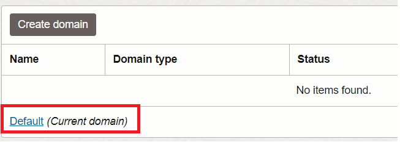
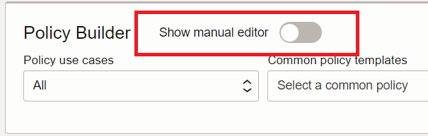
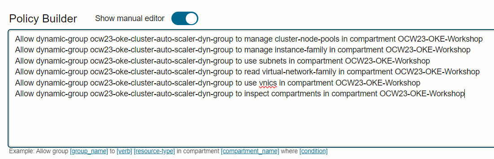

# Cluster Administration and Operations

## Introduction

In the previous lab you enabled your application pods to automatically scale out when the existing capacity becomes insufficient. What happens when additional pods are required but the underlying compute capacity is not sufficient? Enter cluster auto scaling!

In this workshop you will enable the ability for the number of worker nodes in the node pool to increase automatically when additional pods need to be scheduled. With this configuration, the number of worker nodes can also decrease automatically when the extra capacity is no longer required.

<details><summary><b>Additional information: Kubernetes Cluster Autoscaler</b></summary>

You can use the Kubernetes Cluster Autoscaler to automatically resize a cluster's managed node pools based on application workload demands. By automatically resizing a cluster's node pools, you can ensure application availability and optimize costs.

The Kubernetes Cluster Autoscaler is a standalone program that:

* Adds worker nodes to a node pool when a pod cannot be scheduled in the cluster because of insufficient resource constraints.
* Removes worker nodes from a node pool when the nodes have been underutilized for an extended time, and when pods can be placed on other existing nodes.

The Kubernetes Cluster Autoscaler increases or decreases the size of a node pool automatically based on resource requests, rather than on resource utilization of nodes in the node pool.

The Kubernetes Cluster Autoscaler works on a per-node pool basis. You use a configuration file to specify which node pools to target for expansion and contraction, the minimum and maximum sizes for each node pool, and how you want the autoscaling to take place. Node pools not referenced in the configuration file are not managed by the Kubernetes Cluster Autoscaler.

To enable the Kubernetes Cluster Autoscaler to automatically resize a cluster's node pools based on application workload demands, always include resource request limits in pod specifications (requests: under resources:).

</details>

Estimated time: 20 minutes

### Objectives

* Create requisite IAM resources to allow worker nodes to manage node pools
* Deploy the auto scaler application to your Kubernetes cluster
* Force a scaling event by scheduling more pods than the cluster can place

## Task 1: Create IAM Resources
A dynamic group is required to identify the compute resources that will be granted the authorization to perform node pool scaling events.

1. Minimize Cloud Shell (or navigate the following path but *open in new window*) and navigate to **`Identity & Security`** --> **`Domains`**. While the list says *"No Items Found"* note the **Default (Current domain)** at the bottom of the list.  Click there.

    

2. Navigate to **`Dynamic groups`** in the left nav menu, and **`[Create dynamic group]`**.

3. Provide a *name (i.e. oke-cluster-autoscaler-dyn-grp)* and *description*. Then enter the following rule. Be sure to input the Compartment OCID you created earlier.

    ```
    <copy>
    ALL {instance.compartment.id = 'your compartment ocid here within the single quotes'}
    </copy>
    ```

4. Create the group.

5. Now navigate to **`Identity & Security`** and under **`Identity`**, click **`Policies`**.

6. Click **`[Create policy]`**. Enter a name and description once again. I used *ocw23-oke-cluster-autoscaler-dyn-grp-policy* for the name.

7. In the **Policy Builder** section click *Show manual editor* to bring up the free-form entry field.

    

8. Paste in the following policy statements (be sure to imput your own values for dynamnic-group-name and compartment-name):

    ```
    <copy>
    Allow dynamic-group <dynamic-group-name> to manage cluster-node-pools in compartment <compartment-name>
    Allow dynamic-group <dynamic-group-name> to manage instance-family in compartment <compartment-name>
    Allow dynamic-group <dynamic-group-name> to use subnets in compartment <compartment-name>
    Allow dynamic-group <dynamic-group-name> to read virtual-network-family in compartment <compartment-name>
    Allow dynamic-group <dynamic-group-name> to use vnics in compartment <compartment-name>
    Allow dynamic-group <dynamic-group-name> to inspect compartments in compartment <compartment-name>
    </copy>
    ```

    The final policy should look something like this:

    

    <details><summary><b>What permissions did we just create?</b></summary>
    The policy statements above grant the worker nodes (those in the compartment we specified in the dynamic group) access to manage the node pool itself (in order to change the number of worker nodes). It also grants access to create the compute resources in the compartment. **Use subnets** and **Use vnics** allows for the creation of a virtual network interface for the Compute instance, in our OKE node pool subnet.

    ---
    </details>

9. Click `[Create]` to save the new policy.

## Task 2: Apply Cluster configuration

1. Return to Code Editor and create a new file called `cluster-autoscaler.yaml`, then paste the following content:

    ```
    <copy>
    ---
apiVersion: v1
kind: ServiceAccount
metadata:
  labels:
    k8s-addon: cluster-autoscaler.addons.k8s.io
    k8s-app: cluster-autoscaler
  name: cluster-autoscaler
  namespace: kube-system
---
apiVersion: rbac.authorization.k8s.io/v1
kind: ClusterRole
metadata:
  name: cluster-autoscaler
  labels:
    k8s-addon: cluster-autoscaler.addons.k8s.io
    k8s-app: cluster-autoscaler
rules:
  - apiGroups: [""]
    resources: ["events", "endpoints"]
    verbs: ["create", "patch"]
  - apiGroups: [""]
    resources: ["pods/eviction"]
    verbs: ["create"]
  - apiGroups: [""]
    resources: ["pods/status"]
    verbs: ["update"]
  - apiGroups: [""]
    resources: ["endpoints"]
    resourceNames: ["cluster-autoscaler"]
    verbs: ["get", "update"]
  - apiGroups: [""]
    resources: ["nodes"]
    verbs: ["watch", "list", "get", "patch", "update"]
  - apiGroups: [""]
    resources:
      - "namespaces"
      - "pods"
      - "services"
      - "replicationcontrollers"
      - "persistentvolumeclaims"
      - "persistentvolumes"
    verbs: ["watch", "list", "get"]
  - apiGroups: ["extensions"]
    resources: ["replicasets", "daemonsets"]
    verbs: ["watch", "list", "get"]
  - apiGroups: ["policy"]
    resources: ["poddisruptionbudgets"]
    verbs: ["watch", "list"]
  - apiGroups: ["apps"]
    resources: ["statefulsets", "replicasets", "daemonsets"]
    verbs: ["watch", "list", "get"]
  - apiGroups: ["storage.k8s.io"]
    resources: ["storageclasses", "csinodes", "csidrivers", "csistoragecapacities"]
    verbs: ["watch", "list", "get"]
  - apiGroups: ["batch", "extensions"]
    resources: ["jobs"]
    verbs: ["get", "list", "watch", "patch"]
  - apiGroups: ["coordination.k8s.io"]
    resources: ["leases"]
    verbs: ["create"]
  - apiGroups: ["coordination.k8s.io"]
    resourceNames: ["cluster-autoscaler"]
    resources: ["leases"]
    verbs: ["get", "update"]
---
apiVersion: rbac.authorization.k8s.io/v1
kind: Role
metadata:
  name: cluster-autoscaler
  namespace: kube-system
  labels:
    k8s-addon: cluster-autoscaler.addons.k8s.io
    k8s-app: cluster-autoscaler
rules:
  - apiGroups: [""]
    resources: ["configmaps"]
    verbs: ["create","list","watch"]
  - apiGroups: [""]
    resources: ["configmaps"]
    resourceNames: ["cluster-autoscaler-status", "cluster-autoscaler-priority-expander"]
    verbs: ["delete", "get", "update", "watch"]

---
apiVersion: rbac.authorization.k8s.io/v1
kind: ClusterRoleBinding
metadata:
  name: cluster-autoscaler
  labels:
    k8s-addon: cluster-autoscaler.addons.k8s.io
    k8s-app: cluster-autoscaler
roleRef:
  apiGroup: rbac.authorization.k8s.io
  kind: ClusterRole
  name: cluster-autoscaler
subjects:
  - kind: ServiceAccount
    name: cluster-autoscaler
    namespace: kube-system

---
apiVersion: rbac.authorization.k8s.io/v1
kind: RoleBinding
metadata:
  name: cluster-autoscaler
  namespace: kube-system
  labels:
    k8s-addon: cluster-autoscaler.addons.k8s.io
    k8s-app: cluster-autoscaler
roleRef:
  apiGroup: rbac.authorization.k8s.io
  kind: Role
  name: cluster-autoscaler
subjects:
  - kind: ServiceAccount
    name: cluster-autoscaler
    namespace: kube-system

---
apiVersion: apps/v1
kind: Deployment
metadata:
  name: cluster-autoscaler
  namespace: kube-system
  labels:
    app: cluster-autoscaler
spec:
  replicas: 3
  selector:
    matchLabels:
      app: cluster-autoscaler
  template:
    metadata:
      labels:
        app: cluster-autoscaler
      annotations:
        prometheus.io/scrape: 'true'
        prometheus.io/port: '8085'
    spec:
      serviceAccountName: cluster-autoscaler
      containers:
        - image: iad.ocir.io/oracle/oci-cluster-autoscaler:1.27.2-9
          name: cluster-autoscaler
          resources:
            limits:
              cpu: 100m
              memory: 300Mi
            requests:
              cpu: 100m
              memory: 300Mi
          command:
            - ./cluster-autoscaler
            - --v=4
            - --stderrthreshold=info
            - --cloud-provider=oci
            - --max-node-provision-time=25m
            - --nodes=1:5:{{ node pool ocid }}
            - --scale-down-delay-after-add=5m
            - --scale-down-unneeded-time=5m
            - --unremovable-node-recheck-timeout=5m
            - --balance-similar-node-groups
            - --balancing-ignore-label=displayName
            - --balancing-ignore-label=hostname
            - --balancing-ignore-label=internal_addr
            - --balancing-ignore-label=oci.oraclecloud.com/fault-domain
          imagePullPolicy: "Always"
          env:
          - name: OKE_USE_INSTANCE_PRINCIPAL
            value: "true"
          - name: OCI_SDK_APPEND_USER_AGENT
            value: "oci-oke-cluster-autoscaler"
    </copy>
    ```

2. Make note of the command section towards the end of the above YAML content. There are a few items that will need to be adjusted:

    * `--nodes=1:5:{{ node pool ocid}}`: Here you will need to locate the OCID for your OKE node pool, and paste it.  Replace the curly braces in the process so you're left with something like: `--nodes=1:5:ocid1.nodepool.oc1.phx.aaaaaaaaptvbivi24yn7fcfgpq4jovgdgoqakwvmiaje25rp2nncj4gzflja` - This is telling the cluster autoscaler we can scale between 1 and 5 nodes. For the workshop, that's going to be fine.
    
    * The value of `--scale-down-delay-after-add=5m` was reduced for this workshop. To avoid **thrash** (unnecessarily scaling out - in - out - in) this would generally be a bit higher. 

    * The value of `--scale-down-unneeded-time=5m` was also reduced.  This is the duration that the cluster auto scaler will wait before removing resources, once the scale in threshold has been met.

3. Deploy the Kubernetes Cluster Autoscaler with the following command:

    ```
    <copy>
    kubectl apply -f cluster-autoscaler.yaml
    </copy>
    ```

4. It will take a minute or two to initialize. While you wait, feel free to check the logs:

    ```
    <copy>
    kubectl -n kube-system logs -f deployment.apps/cluster-autoscaler
    </copy>
    ```

    >NOTE: Press ctrl+c to exit at any time.

5. Check the status of the Cluster Autoscaler. 

    ```
    <copy>
    kubectl -n kube-system get cm cluster-autoscaler-status -oyaml
    </copy>
    ```

    ```bash
    apiVersion: v1
data:
  status: |+
    Cluster-autoscaler status at 2023-08-17 19:05:01.231858842 +0000 UTC:
    Cluster-wide:
      Health:      Healthy (ready=2 unready=0 (resourceUnready=0) notStarted=0 longNotStarted=0 registered=2 longUnregistered=0)
                   LastProbeTime:      2023-08-17 19:05:01.230614368 +0000 UTC m=+525.142735557
                   LastTransitionTime: 2023-08-17 18:58:58.014039222 +0000 UTC m=+161.926160412
      ScaleUp:     NoActivity (ready=2 registered=2)
                   LastProbeTime:      2023-08-17 19:05:01.230614368 +0000 UTC m=+525.142735557
                   LastTransitionTime: 2023-08-17 18:58:58.014039222 +0000 UTC m=+161.926160412
      ScaleDown:   NoCandidates (candidates=0)
                   LastProbeTime:      2023-08-17 19:05:01.230614368 +0000 UTC m=+525.142735557
                   LastTransitionTime: 2023-08-17 18:58:58.014039222 +0000 UTC m=+161.926160412

    NodeGroups:
      Name:        ocid1.nodepool.oc1.phx.aaaaaaaaptvbivi24yn7fcfgpq4jovgdgoqakwvmiaje25rp2nncj4gzflja
      Health:      Healthy (ready=2 unready=0 (resourceUnready=0) notStarted=0 longNotStarted=0 registered=2 longUnregistered=0 cloudProviderTarget=2 (minSize=1, maxSize=5))
                   LastProbeTime:      2023-08-17 19:05:01.230614368 +0000 UTC m=+525.142735557
                   LastTransitionTime: 2023-08-17 18:58:58.014039222 +0000 UTC m=+161.926160412
      ScaleUp:     NoActivity (ready=2 cloudProviderTarget=2)
                   LastProbeTime:      2023-08-17 19:05:01.230614368 +0000 UTC m=+525.142735557
                   LastTransitionTime: 2023-08-17 18:58:58.014039222 +0000 UTC m=+161.926160412
      ScaleDown:   NoCandidates (candidates=0)
                   LastProbeTime:      2023-08-17 19:05:01.230614368 +0000 UTC m=+525.142735557
                   LastTransitionTime: 2023-08-17 18:58:58.014039222 +0000 UTC m=+161.926160412

    kind: ConfigMap
    metadata:
    annotations:
        cluster-autoscaler.kubernetes.io/last-updated: 2023-08-17 19:05:01.231858842 +0000
        UTC
    creationTimestamp: "2023-08-17T18:29:02Z"
    name: cluster-autoscaler-status
    namespace: kube-system
    resourceVersion: "867523"
    uid: 24bcc1d5-d211-4ac1-82f7-de94392f3bf2
    ```

## Task 3: Test the Cluster Autoscaler

1. Before generating an event that will trigger scaling, first check the current nodes in the cluster.

    ```
    <copy>
    kubectl get nodes
    </copy>
    ```

    ```
    eli_devrel@cloudshell:~ (us-phoenix-1)$ kubectl get nodes
    NAME          STATUS   ROLES   AGE   VERSION
    10.0.10.227   Ready    node    52m   v1.27.2
    10.0.10.28    Ready    node    52m   v1.27.2
    ```

2. Now it's time to deploy a simple nginx app via manifest (as-test-yaml). Notice the resource request limit memory of *500Mi*. This is done on purpose to quickly exhaust the available capacity in the two worker nodes.

    ```
    <copy>
    apiVersion: apps/v1
    kind: Deployment
    metadata:
    name: nginx-deployment
    spec:
    selector:
        matchLabels:
        app: nginx
    replicas: 2
    template:
        metadata:
        labels:
            app: nginx
        spec:
        containers:
        - name: nginx
            image: nginx:latest
            ports:
            - containerPort: 80
            resources:
            requests:
                memory: "500Mi"
    </copy>
    ```

3. Apply the manifest:

    ```
    <copy>
    kubectl apply -f as-manifest.yaml
    </copy>
    ```

4. Time to kick this test into overdrive! Go ahead and increase the number of pods in the deployment to 50.

    ```
    <copy>
    kubectl scale deployment nginx-deployment --replicas=50
    </copy>
    ```

5. Now monitor the effects that result from the increase in pods:

    ```
    <copy>
    kubectl get deployment nginx-deployment --watch
    </copy>
    ```

    Provided you only have two worker nodes in the node pool, it should stop around 40 or so pods:

        ```bash
        eli_devrel@cloudshell:~ (us-phoenix-1)$ kubectl get deployment nginx-deployment --watch
        NAME               READY   UP-TO-DATE   AVAILABLE   AGE
        nginx-deployment   23/50   50           23          2m20s
        nginx-deployment   24/50   50           24          2m20s
        nginx-deployment   25/50   50           25          2m20s
        nginx-deployment   26/50   50           26          2m21s
        nginx-deployment   27/50   50           27          2m21s
        nginx-deployment   28/50   50           28          2m22s
        nginx-deployment   29/50   50           29          2m22s
        nginx-deployment   30/50   50           30          2m23s
        nginx-deployment   31/50   50           31          2m24s
        nginx-deployment   32/50   50           32          2m24s
        nginx-deployment   33/50   50           33          2m24s
        nginx-deployment   34/50   50           34          2m25s
        nginx-deployment   35/50   50           35          2m26s
        nginx-deployment   36/50   50           36          2m26s
        nginx-deployment   37/50   50           37          2m27s
        nginx-deployment   38/50   50           38          2m28s
        nginx-deployment   39/50   50           39          2m28s
        nginx-deployment   40/50   50           40          2m29s
        nginx-deployment   41/50   50           41          2m30s
        ```

6. At this point, you can minimize Cloud Shell and look at your node pool. It should be updating, adding another node.  It's ok to leave the watch command running in Cloud Shell. Once the new node is functional, the additional pods will be scheduled.

7. Once you see all 50 pods successfully scheduled, type **ctrl+c** to quit. Then type **`kubectl get nodes`** to check your node pool.  Should be an extra one there (just like you saw in the Web UI)

## Task 4: Clean up

1. Delete the deployment:

    ```
    <copy>
    kubectl delete deployment nginx-deployment
    </copy>
    ```

2. Remember that the Cluster Autoscaler configuration has a parameter to wait 5 minutes before removing unneeded nodes. You may choose to wait and check...or come back later and validate. Just run **`kubectl get nodes`** again to confirm that the extra node was removed.


You may now **proceed to the next lab**.

## Learn More

* [Oracle Docs - Cluster Auto Scaling](https://docs.oracle.com/en-us/iaas/Content/ContEng/Tasks/contengusingclusterautoscaler.htm)
* [GitHub - Kubernetes Cluster Auto Scaling](https://github.com/kubernetes/autoscaler/tree/master/cluster-autoscaler)

## Acknowledgements

* **Author** - Eli Schilling - Developer Advocate
* **Contributors** - Chip Hwang - Sr. Principal Tech Marketing Engineer
* **Last Updated By/Date** - August 2023
