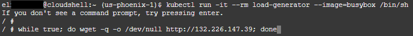
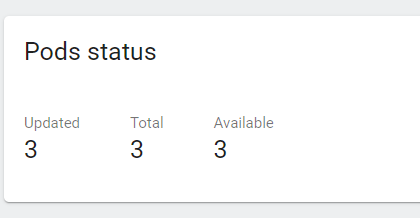
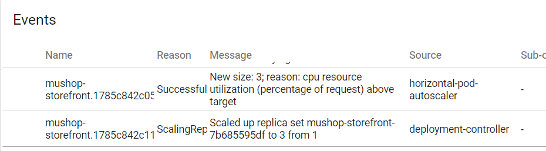
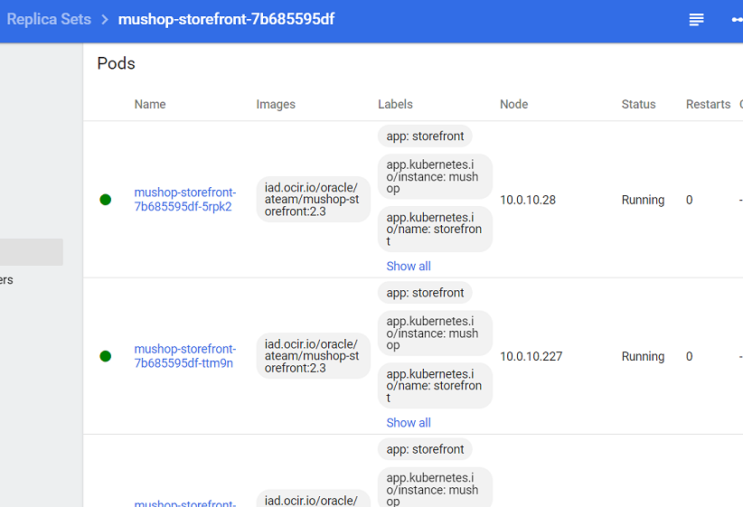

# Setting up Auto scaling

## Introduction

Auto scaling is a critical part of managing Kubernetes at scale. By leveraging metrics generated within your cluster, you can define when additional resources are provisioned to support your workloads, thus reducing the need for more manual work.

**Estimated module duration** 20 mins.

### Objectives

This module explores how you can configure Kubernetes to automatically scale the number of pods for your service to handle changes in demand with no manual intervention.

### Prerequisites

You need to complete the **Horizontal Scaling** module.

## Task 1: Horizontal autoscaling - based on CPU load or Memory usage

We've seen how we can increase (or decrease) the number of pods underlying a service and that the service will automatically balance the load across the pods for us as the pod count changes.

This is great, but it required manual intervention to change the number of pods, and that means we need to keep an eye on what's happening. Fortunately for us Kubernetes has support for automating this process based on rules we define.

This is the simplest form of auto scaling, though it is also the least flexible as CPU and memory usage may not always be the most effective indicator of when scaling is required. 

To gather the data we need to have installed the metrics server. This is a replacement for an older Kubernetes service called heapster. 

Note that it's also possible to use Prometheus as a data source which will allow you to auto-scale on custom metrics, for example the number of requests to your service. 

For now we are going to use the simplest approach of the metrics server.

### Task 1a: Installing the metrics server

  1. Install a helm repo that contains the chart for the metrics server
  
    ```bash
    <copy>
    helm repo add metrics-server https://kubernetes-sigs.github.io/metrics-server/
    </copy>
    ```
  
  2. Update the repo
  
    ```bash
    <copy>
    helm repo update
    </copy>
    ```
  
    ```
    Hang tight while we grab the latest from your chart repositories...
    ...Successfully got an update from the "metrics-server" chart repository
    ```

  3. In the OCI Cloud Shell install the metrics server by typing
  
    ```bash
    <copy>
    helm -n kube-system install metrics-server metrics-server/metrics-server --version 3.10.0
    </copy>
    ```

    ```
    NAME: metrics-server
    LAST DEPLOYED: Fri Jun  23 19:11:45 2023
    NAMESPACE: kube-system
    STATUS: deployed
    REVISION: 1
    TEST SUITE: None
    NOTES:
    ***********************************************************************
    * Metrics Server                                                      *
    ***********************************************************************
      Chart version: 3.10.0
      App version:   0.6.3
      Image tag:     registry.k8s.io/metrics-server/metrics-server:v0.6.3
    ***********************************************************************
    ```

It will take a short time for the metrics server to start up, but you can check the progress using kubectl

4. In the OCI Cloud Shell type
  
    ```bash
    <copy>kubectl get deployments -n kube-system</copy>
    ```
  
    ```
    NAME                   READY   UP-TO-DATE   AVAILABLE   AGE
    coredns                3/3     1            1           17m
    kube-dns-autoscaler    1/1     1            1           17m
    kubernetes-dashboard   1/1     1            1           15m
    metrics-server         1/1     1            1           39s
    ```

### Task 1b: Using the captured metrics

Once the metrics server is running (it will have an AVAILABLE count of 1) you can get information on the state of the system

  1. Let's look at how the nodes in the cluster are doing. In the OCI Cloud Shell type
  
    ```bash
    <copy>kubectl top nodes</copy>
    ```

    ```
    NAME        CPU(cores)   CPU%   MEMORY(bytes)   MEMORY%   
    10.0.10.2   73m          3%     1561Mi          23%       
    10.0.10.3   109m         5%     1834Mi          27%       
    10.0.10.4   157m         7%     1232Mi          18%       
    ```
 
    If you get an response `error: metrics not available yet` then it just means that the metrics server is running, but hasn't completed it's initial data capture yet. Wait a short while and try the `kubectl top nodes` again.
  
    Note that this was from a cluster with three nodes, depending on the size of your cluster you will see a different number of nodes output.
  
  2. We can also see the status of the pods in terms of what they are using. In the OCI Cloud Shell type
  
    ```bash
    <copy>kubectl top pods</copy>
    ```

    ```
    NAME                           CPU(cores)   MEMORY(bytes)   
    mushop-api-88bd7c499-qcwcp           1m           12Mi            
    mushop-assets-7f97df7bbd-zsmgc       1m           7Mi             
    mushop-edge-5d6f7ccf67-xdvr2         1m           10Mi            
    mushop-session-864cb5b4db-vqpxr      1m           7Mi             
    mushop-storefront-7b685595df-sczzf   1m           1Mi               
    ```

    **Note** that like the other times we've used kubectl this uses the namespace configured as the default when you ran the create-namespace.sh command

  3. Let's have a look at what's happening in the kube-system namespace. In the OCI Cloud Shell type
  
    ```bash
    <copy>kubectl top pods -n kube-system</copy>
    ```

    ```
    NAME                                    CPU(cores)   MEMORY(bytes)   
    coredns-85f945b85d-c7ddm                4m           10Mi            
    coredns-85f945b85d-vrbgp                3m           10Mi            
    coredns-85f945b85d-zjzgl                4m           10Mi            
    kube-dns-autoscaler-7bcf86584b-8tct6    1m           6Mi             
    kube-flannel-ds-5w4k8                   3m           11Mi            
    kube-flannel-ds-b7dwm                   5m           13Mi            
    kube-flannel-ds-jhvgf                   3m           11Mi            
    kube-proxy-chk7h                        1m           12Mi            
    kube-proxy-lrlc5                        4m           11Mi            
    kube-proxy-mp784                        2m           12Mi            
    kubernetes-dashboard-77f54dc48f-9sbdh   1m           10Mi            
    metrics-server-55d8d46477-fzztx         5m           17Mi            
    proxymux-client-99q9z                   1m           8Mi             
    proxymux-client-ffprz                   1m           8Mi             
    proxymux-client-lr7ft                   1m           8Mi   
    ```

<details><summary><b>Kubernetes dashboard and the metrics-server</b></summary>


The metrics server provides information on the current use of resources in the cluster, the Kubernetes dashboard has just been updated to version 2, at some point the plan is that the dashboard will be able to connect to the metrics-server and you will be able to see the pod CPU and memory usage in the dashboard

---

</details>

You can see in the output above that all of the pods are using very small amounts of CPU here, this is because we're not really putting any load on them. Let's run a script that will put load on the services to see what's happening.


  4. To generate load, you'll use a container with the BusyBox image.

    ```
    <copy>
    kubectl run -it --rm load-generator --image=busybox /bin/sh
    </copy>
    ```

  5. This is going to run the container with interactive prompt allowing you to execute local commands.  Generate load with the following command:

    ```
    <copy>
    while true; do wget -q -o /dev/null http://{your external ip}; done
    </copy>
    ```

    >Note: You cannot leverage the *$EXTERNAL_IP* variable here because the command executes in the BusyBox container, not you Cloud Shell environment.

    

  6. Open up a new window on the OCI console (duplicate the existing browser tab)
  
  7. Open up the OCI Cloud shell in the new window.
  
    Let the BusyBox command run for about 75 seconds to allow time for the load to increase.

  8. In the **new** OCI Cloud Shell type
  
    ```bash
    <copy>kubectl top pods</copy>
    ```
  
    ```
    NAME                           CPU(cores)   MEMORY(bytes)  
    load-generator                       12m         0Mi  
    mushop-api-88bd7c499-qcwcp           1m           12Mi            
    mushop-assets-7f97df7bbd-zsmgc       1m           7Mi             
    mushop-edge-5d6f7ccf67-xdvr2         7m           25Mi            
    mushop-session-864cb5b4db-vqpxr      1m           7Mi             
    mushop-storefront-7b685595df-sczzf   16m           1Mi              
    ```

    You'll see the CPU load has increased, as the data is averaged over a short period of time you may have to wait a short while (say 30 seconds) for it to update.

  9. In the **new** OCI Cloud Shell (after waiting for a little bit) type
  
    ```bash
    <copy>kubectl top pods</copy>
    ```
  
    ```
    NAME                           CPU(cores)   MEMORY(bytes) 
    load-generator                       127m         0Mi   
    mushop-api-88bd7c499-qcwcp           1m           12Mi            
    mushop-assets-7f97df7bbd-zsmgc       1m           7Mi             
    mushop-edge-5d6f7ccf67-xdvr2         19m          25Mi          
    mushop-session-864cb5b4db-vqpxr      1m           7Mi             
    mushop-storefront-7b685595df-sczzf   230m         1Mi           
    ```

    Notice that in this particular example the CPU here for the *mushop-storefront* is at 230m (your number may be different). This is very close the limit allowed in the storefront deployment.yaml file, which has a resource restriction of 300 milli CPU specified. 

    Don't worry if the load doesn't reach the specified limit. The best practice is to initiate a scaling action while you still have a little bit of capacity left.


  10. You can get the current resource level for the container using kubectl and the jsonpath capability. In the OCI Cloud Shell (substitute your storefront pod name) type 
  
    ```bash
    <copy>
    kubectl get pod mushop-storefront-79c465dc6b-x8fbl -o=jsonpath='{.spec.containers[0].resources.limits.cpu}' && echo " "
    </copy>
    ```
 
    ```
    300m
    ```
 
  11. In the OCI Cloud shell window running the load generator, stop it using Control-C. The BusyBox container will continue running, awaiting additional commands.

<details><summary><b>Namespace level resource restrictions and implications</b></summary>

In Kubernetes you can place restrictions on pods as we've seen above, however it's also possible to apply a quota on the namespace. All of the pods (or other resources) in the name space have to be within that limit. To do this you create a ResourceQuota (there is one for each namespace) The ResourceQuota allows you to specify limits on CPU, memory storage and also it's possible to extend these with custom resources (e.g. GPU if your cluster hardware has these) Some resources can also be limited on the resource count e.g. number of configmaps.

If an action like adding an object would cause the limits applied to a namespace to be exceeded then the action will be rejected. This applies to auto scaling as well!

Importantly, if you have a ResourceQuota like CPU or memory usage applied to a namespace, then each pod must also have a limit applied to it, if it's not there then either a default will be applied or the create object request will be rejected. (the exact action is deployment specific)

---

</details>

## Task 3: Configuring the autoscaler

That we have hit the limit is almost certainly a problem, it's quite likely that the performance of the service is limited out because of this. Of course it may be that you have made a deliberate decision to limit the service, possibly to avoid overloading the back end database (though as it's an ATP database it can scale automatically for you if the load gets high)

To fix this problem we need to add more pods, but we don't want to do this by hand, that would mean we'd have to be monitoring the system all the time. Let's use a the Kubernetes autoscale functionality to do this for us 

Setup autoscale (normally of course this would be handled using modifications to the YAML file for the deployment)

**If your CPU load was not exceeding 125** then reduce the `--cpu-percent` setting to a lower number so that it's below the required level. For example if the CPU load for the pod was not exceeding 50 (so 20% of the allowed load on a single pod) then a setting of `--cpu-percent=15` will trigger a scaling.

  1. In the OCI Cloud Shell create an auto scaller
  
    ```bash
    <copy>kubectl autoscale deployment mushop-storefront --min=1 --max=3 --cpu-percent=25</copy>
    ```
  
    ```
    horizontalpodautoscaler.autoscaling/mushop-storefront autoscaled
    
    ```
    The autoscaler will attempt to achieve a target CPU load of 25%, (or whatevery you used) adding or removing pods to the deployment as needed to meet that goal, but never going below two pods or above 5


    We can see what the system has found by looking in the Horizontal Pod Autoscalers

  2. In the OCI Cloud Shell type 
  
    ```bash
    <copy>kubectl get horizontalpodautoscaler mushop-storefront</copy>
    ```

    ```
    NAME         REFERENCE                          TARGETS    MINPODS   MAXPODS   REPLICAS   AGE
    <tbd>        Deployment/mushop-storefront       1%/25%     1         3         1          44s
    ```

    Of course typing `horizontalpodautoscaler` takes some time, so kubectl has an alias setup for us, we can just type `hpa` instead, for example

    ```
    kubectl get hpa mushop-storefront
    NAME         REFERENCE               TARGETS    MINPODS   MAXPODS   REPLICAS   AGE
    tbd           Deployment/tbd         1%/25%     1         3         1          56s
    ```

    A few points on the output The TARGET column tells us what the **current** load is first, this is the average across **all** the pods in the deployment, Then the target load the autoscaler will aim to achieve by adding or removing pods.

    You can get more detail on the autoscaler state

  3. Getting the autoscaler details. In the OCI Cloud Shell type
  
    ```bash
    <copy>kubectl describe hpa mushop-storefront</copy>
    ```

    ```
    Name:                     mushop-storefront
    Namespace:                default
    Labels:                   <none>
    Annotations:              autoscaling.alpha.kubernetes.io/conditions:
                                [{"type":"AbleToScale","status":"True","lastTransitionTime":"2023-07-26T18:42:43Z","reason":"ReadyForNewScale","message":"recommended size...}]
                              autoscaling.alpha.kubernetes.io/current-metrics:
                                [{"type":"Resource","resource":{"name":"cpu","currentAverageUtilization":1,"currentAverageValue":"1m"}}]
    CreationTimestamp:        Wed, 26 Jul 2023 18:42:28 +0000
    Reference:                Deployment/mushop-storefront
    Target CPU utilization:   25%
    Current CPU utilization:  1%
    Min replicas:             1
    Max replicas:             3
    Deployment pods:          1 current / 1 desired
    Events:                   <none>
    ```

    Now run the load generator command again.

  4. In the OCI Cloud Shell where you were running the load generator previously (you can use the up arrow to recall the last command):
  
    ```bash
    <copy>while true; do wget -q -o /dev/null http://{your public IP}; done</copy>
    ```

  5. Switch to the second cloud shell window in your browser.

    Allow a short time for the load to be recorded, then look at the load on the pods.

  6. Go ahead and check to see if there is load. In the OCI Cloud Shell type
  
    ```bash
    <copy>kubectl top pods</copy>
    ```

    ``` 
    NAME                                 CPU(cores)   MEMORY(bytes)   
    load-generator                       127m         0Mi             
    mushop-api-88bd7c499-tdv9j           1m           14Mi            
    mushop-assets-7f97df7bbd-6t765       1m           7Mi             
    mushop-edge-5d6f7ccf67-966wz         99m          26Mi            
    mushop-session-864cb5b4db-czvbx      1m           7Mi             
    mushop-storefront-7b685595df-26rxr   3m           1Mi             
    mushop-storefront-7b685595df-49v55   63m          1Mi             
    mushop-storefront-7b685595df-ftkjj   1m           1Mi           
    ```

    Notice that the load on the pods has increased and additional mushop-storefront pods have been scheduled.

  7. Let's look at the autoscaler. In the OCI Cloud Shell type
  
    ```bash
    <copy>kubectl get hpa mushop-storefront</copy>
    ```

    ```
    NAME                REFERENCE                       TARGETS   MINPODS   MAXPODS   REPLICAS   AGE
    mushop-storefront   Deployment/mushop-storefront    75%/25%   1         3         3          16m
    ```

    The current load (in this case 75%) is above the 25% target. The autoscaler kicked in quickly and proivioned additional pods.

  8. Let's look at the autoscaler details. In the OCI Cloud Shell type
  
    ```bash
    <copy>kubectl describe hpa mushop-storefront</copy>
    ```
  
    ```
    Name:                     mushop-storefront
    Namespace:                default
    Labels:                   <none>
    Annotations:              autoscaling.alpha.kubernetes.io/conditions:
                                [{"type":"AbleToScale","status":"True","lastTransitionTime":"2023-07-26T18:42:43Z","reason":"ScaleDownStabilized","message":"recent recomm...}]
                              autoscaling.alpha.kubernetes.io/current-metrics:
                                [{"type":"Resource","resource":{"name":"cpu","currentAverageUtilization":72,"currentAverageValue":"72m"}}]
    CreationTimestamp:        Wed, 26 Jul 2023 18:42:28 +0000
    Reference:                Deployment/mushop-storefront
    Target CPU utilization:   25%
    Current CPU utilization:  72%
    Min replicas:             1
    Max replicas:             3
    Deployment pods:          3 current / 3 desired
    Events:
      Type    Reason             Age   From                       Message
      ----    ------             ----  ----                       -------
      Normal  SuccessfulRescale  3m7s  horizontal-pod-autoscaler  New size: 3; reason: cpu resource utilization (percentage of request) above target
    ```

    In fact, it seems that in the time between the commands above the short term average load increased sufficiently that the autoscaler having determined it wanted three pods.


  9. Let's look at those pods. In the OCI Cloud Shell type
  
    ```bash
    <copy>kubectl top pods</copy>
    ```

    ``` 
    NAME                                 CPU(cores)   MEMORY(bytes)   
    load-generator                       343m         0Mi             
    mushop-api-88bd7c499-tdv9j           1m           15Mi            
    mushop-assets-7f97df7bbd-6t765       1m           7Mi                        
    mushop-edge-5d6f7ccf67-vrzrl         32m          13Mi            
    mushop-session-864cb5b4db-czvbx      1m           7Mi             
    mushop-storefront-7b685595df-26rxr   40m          1Mi             
    mushop-storefront-7b685595df-49v55   95m          1Mi             
    mushop-storefront-7b685595df-ftkjj   107m         1Mi          

    ```

    All 3 pods are running and the service is distributing the load amongst them. If the above series of commands were executed in a *very* short period of time, some of the storefront pods may still in their startup phase.

  10. Let's get the autoscaler summary again. In the OCI Cloud Shell type
  
    ```bash
    <copy>kubectl get hpa mushop-storefront</copy>
    ```
  
    ```
    NAME                REFERENCE                      TARGETS   MINPODS   MAXPODS   REPLICAS   AGE
    mushop-storefront   Deployment/mushop-storefront   66%/25%   1         3         3          30m
    ```

    We can see that the average load across the deployment is still over 25%, if is had not reached the maximum number of pods then the auto scaler would be trying to meet our goal of no more than 25% average load by adding additional pods.

    If you want you can also see the pods being added in the Kubernetes dashboard,  

  11. Open the Kubernetes Dashboard

  12. Make sure you are in the default namespace

  13. In the left menu under _workloads_ select **Deployments** then click on the `mushop-storefront` deployment.

  14. In the **Pods** section you can see that in this case it's scaled to 3 pods

    

  15. Scroll down to the **Events** section and you can seen the changes it's made

    

  16. You can see the pod details by opening the replica set.

    

  17. Return to the cloud shell window where the load generator is running. Stop the command by typing Control-C. Then type **`exit`** and press enter to leave the BusyBox container.

    Note that the metrics server seems to operate on a decaying average basis, so stopping the load generating script will not immediately drop the per pod load. This means that it may take some time after stopping the load generator script for the autoscaler to start removing unneeded pods.   

    The autoscaler tries not to "thrash" the system by starting and stopping pods all the time. Because of this it will only remove pods every few minutes rather than immediately the load becomes low, additionally it will also only remove a few pods at a time. The [autoscaler documentation](https://kubernetes.io/docs/tasks/run-application/horizontal-pod-autoscale/#algorithm-details) describes the algorythm.

  18. In the OCI Cloud Shell type
  
    ```bash
    <copy>kubectl delete hpa mushop-storefront</copy>
    ```

    ```
    horizontalpodautoscaler.autoscaling "mushop-storefront" deleted
    ```

    Note that this just stops changes to the number of pods, any existing pods will remain, even if there are more (or less) than specified in the deployment document. Of course now the auto scaler has been deleted regardless of the load that number will no longer change automatically.

    To return to the numbers of replicas originally defined we'll use kubectl

  19. If you would like to force the deployment to scale in, you can type the following in OCI Cloud Shell
  
    ```bash
    <copy>kubectl scale --replicas=1 deployment mushop-storefront</copy>
    ```

    ```
    deployment.apps/mushop-storefront scaled
    ```

    Now let's check what's happening

  20. In the OCI Cloud Shell type
  
    ```bash
    <copy>kubectl get deployment mushop-storefront</copy>
    ```

    ```
    NAME           READY   UP-TO-DATE   AVAILABLE   AGE
    storefront     1/1     1            1           4d2h

    ```

The number of pods is now back to one (it may be that you get a report of 2 pods still running, in which case try getting the deployment again a little bit later).

## Task 4: Autoscaling on other metrics
We have here looked at how to use CPU and memory to determine when to autoscale, that may be a good solution, or it may not. Kubernetes autoscaling can support the use of other metrics to manage autoscaling.

These other metrics can be other Kuberneties metrics (known as custom metrics) for example the number of requests to the ingress controller, or (with the provision of the [Prometheus Adaptor (helm chart)](https://github.com/prometheus-community/helm-charts)) any metric that Prometheus gathers. This last is especially useful as it means you can autoscale on what are effectively business metrics.

It's also possible to autoscale on metrics provides from outside Kubernetes (these are known as external metrics). this is only recommended as a last resort however due to the security implications, and custom metrics are preferred.

The [autoscaler docs explain some of these](https://kubernetes.io/docs/tasks/run-application/horizontal-pod-autoscale-walkthrough/#autoscaling-on-multiple-metrics-and-custom-metrics)

## Task 4: Other forms of AutoScaling
Here we have looked a how to have Kubernetes create new pods based on load (horizontal auto scaling). 

OKE also supports vertical auto scaling (increasing the allowed resource limits on a pod) and to allow for situations where a pod may not sale horizontally that well. 

There is another form of auto scaling which can be enabled called cluster autoscaling, this monitors the cluster to see if it's got any pods that can't be deployed because there are no available workers with enough suitable capacity, it will create new worker nodes as needed and if there are to many worker nodes for the overall load in the cluster it will shuffle pods of nodes and stop the node.

### Additional information

Autoscaler and rolling upgrades - The autoscaler will correctly operate in conjunction with rolling upgrades.

## End of the module, what's next ?

You have reached the end of this section of the lab. The next module is `Rolling Updates`

## Acknowledgements

* **Author** - Eli Schilling - Developer Advocate
* **Contributor** - Chip Hwang - Sr. Principal Tech Marketing Engineer
* **Last Updated By** - August 2023