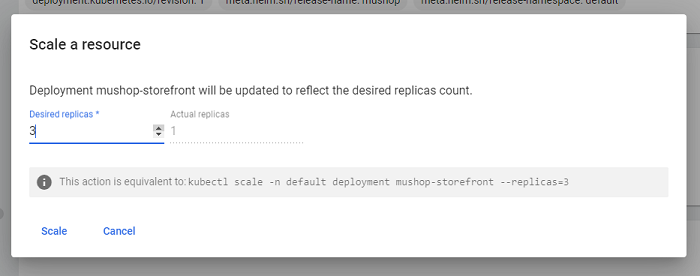

# Cluster Administration and Operations

## Introduction

In this lab you will explore some of the fundamental capabilities of Kubernetes and learn how to execute those common tasks within OKE. This includes:

1. Administration tasks: 
    1. Using the Kubernetes Dashboard
    2. Cluster and Node Pool Upgrades
    3. Creating and scaling node pools
2. Operational tasks
    1. Manually scaling an existing deployment (K8s dashboard)
    2. Horizontal pod scaling
    3. Working with Cluster Autoscaler

Estimated time: 45 minutes

### Objectives

In this lab you will familiarize yourself with a variety of administration and operations activities commonly used with OKE. You may notice many of these are standard Kubernetes functionality, but there are a number of OKE-specific capabilities that make managing your Kubernetes environment a little bit easier.

## Task 1: Deploy and access the Kubernetes Dashboard

The Kubernetes dashboard is a managed add-on and can be deployed when the cluster is first created. For the sake of this workshop, we chose to walk through the process of enabling this add-on later.

Before getting started, you will need to change your config context back to the OKE cluster deployed in lab 2. Confirm the context name of the original cluster and use it to run the following command:

```bash
<copy>
kubectl config use-context k8s-managed
</copy>    
```

Alright, good to go!

### Task 1a: Enable the Kubernetes Dashboard add-on

1. Open the OCI console and navigate to **Developer Services** -> **Kubernetes Clusters (OKE)**. 

2. Locate and click the cluster you created in Lab 2.

3. Under **Resources** on the left-hand side of the screen, click *Add-ons*.

4. Click **`Manage Add-ons`** and then click the *Kubernetes dashboard* add-on. In the dialog that appears, click the checkbox to enable it. Then **`Save changes`**:

    

5. It will take about a minute to provision. When complete, it will show as `Ready` in the Add-ons table:

    

6. By default, the Kubernetes Dashboard is not publicly accessible. You would normally run `kube proxy` locally, then connect through the proxy via `localhost`. [Read more about it here.](https://docs.oracle.com/en/operating-systems/olcne/1.5/orchestration/dashboard.html#dashboard)

    For this workshop, you'll expose the dashboard via LoadBalancer for ease of access. Now that the add-on setup is complete, edit the service to change `spec:type` to **LoadBalancer**

    ```bash
    <copy>
    kubectl -n kube-system edit service kubernetes-dashborad
    </copy>
    ```

7. Scroll down to the **spec** section and locate the **type**. Press `i` to enter insert mode, then delete *ClusterIP* and replace with *LoadBalancer*.

    <details><summary><b>OPTIONAL: Create flexible-shape load balancer</b></summary>
    
    By default, this action will create a 100mbps load balancer. To take advantage of the more efficient, flexible load balancer shape, you may choose to add a few annotations to the kubernetes-dashboard service. If you'd like to try it out, add the following under the **`metadata`** section.

    ```yaml
    <copy>
    annotations:
      oci.oraclecloud.com/load-balancer-type: lb
      service.beta.kubernetes.io/oci-load-balancer-shape: flexible
      service.beta.kubernetes.io/oci-load-balancer-shape-flex-max: "100"
      service.beta.kubernetes.io/oci-load-balancer-shape-flex-min: "10"
    </copy>
    ```

    Make sure the spacing is correct. `annotations:` should be two spaces in from `metadata:`, and each of the 4 statements should be 2 spaces in from `annotations:`.

    

    ---

    </details>

    The save and exit process is similar to Vim: `esc`, `:wq`, `Enter`

8. It will take a minute or two to provision the OCI Load Balancer and update the service. Check it with the following command (we're ready to move forward when the `EXTERNAL-IP` becomes available):

    ```bash
    <copy>
    kubectl get svc -n kube-system kubernetes-dashboard
    </copy>
    ```

    The output should look like:

    ```console
    NAME                   TYPE           CLUSTER-IP     EXTERNAL-IP     PORT(S)         AGE
    kubernetes-dashboard   LoadBalancer   10.96.87.203   129.153.68.11   443:32326/TCP   13m
    ```

9. Copy the `EXTERNAL-IP` and open a new browser window or tab. Navigate to *https://{your external IP}*.

    > Note: Because the dashboard is utilizing HTTPS and there's no SSL Certificate deployed, your browser may present a security warning. It is ok to proceed past this to the login page.

### Task 1b: Create a sample user and log into the Kubernetes Dashboard

1. Return to the other browser window with your Cloud Shell. In order to log into the Kubernetes dashboard, a token is required. You will create a service account user `dashboard-user` in the namespace `kube-system`.

2. You will need to create a new manifest file named `dashboard-user.yaml` (either in Cloud Shell with Vim or Code Editor). Paste the following into the file, then save it:

    ```yaml
    <copy>
    apiVersion: v1
    kind: ServiceAccount
    metadata:
      name: dashboard-user
      namespace: kube-system
    ---

    apiVersion: rbac.authorization.k8s.io/v1
    kind: ClusterRoleBinding
    metadata:
      name: dashboard-user
    roleRef:
      apiGroup: rbac.authorization.k8s.io
      kind: ClusterRole
      name: cluster-admin
    subjects:
    - kind: ServiceAccount
      name: dashboard-user
      namespace: kube-system
    ---
    </copy>
    ```

3. Apply the manifest file to your cluster:

    ```bash
    <copy>
    kubectl apply -f dashboard-user.yaml
    </copy>
    ```

4. Create the token for your *dashboard-user*:

    ```bash
    <copy>
    kubectl -n kube-system create token dashboard-user
    </copy>
    ```

    The output will be a rather lengthy string that constitutes your token. Copy this and store it in a text file, just for good measure.

    

5. Return to the browser window where you opened the Dashboard web page. Ensure the **Token** radio button is selected, and paste your token in the line below:
    
    
    
6. After successfully logging in, feel free to have a look around. You will have a chance to work more in the Dashboard during later labs.

    

    > Note: The Kubernetes dashboard will only keep the login session open for a short time, after which you will be logged out. Unfortunately, when your login session expires, the Kubernetes dashboard doesn't always return you to the login screen. If you find that you are making changes and the dashboard doesn't reflect them, or that you can see something using kubectl but not in the dashboard, or you trigger an action on the dashboard (e.g. switching to a different a namespace) but the content doesn't update, it's probable that the session has expired. In this case, reload the web page or go to the login URL (above), this will reset the page's state and present you with the login screen again. Log in using your token as you did before (the token does not change, so you don't have to extract it again).

## Task 2: Manually scaling an existing deployment

Microservices should be designed to scale horizontally, i.e. pods are added or removed to meet the requirements of the application. We'll cover autoscaling in the next lab. For now, take a look at the process for adding or removing pods manually.

Why would you want to scale manually? Generally this is done for testing purposes -- you may want to know how the application will perform with a certain number of pods (baseline performance, max capacity, etc.). You might also want to test your application to see how it will handle the unexpected evacuation of a pod. Certainly, you designed your app to handle such things, but let's just be certain!

1. Open the Kubernetes dashboard (if it's been more than 15 minutes since you completed the last lab, you may need to log in again). In the left menu under the **Workloads** section choose **Deployments**:

    

    While you can go directly to the Replica sets page, it's worth noting how the two are connected.

    You should see the 5 deployments here that were created when MuShop was deployed earlier.

2. Click the `mushop-storefront` deployment for more details:

    

3. After perusing the details of this deployment, scroll down and locate the **Replica sets** section:

    

    In the **New Replica Set** section you can see details of the current replica set. There is nothing in the **Old Replica Set** section because no rolling updates have been applied. We'll get to that later.

4. In the **New Replica Set** section, click on the replica set name to view more details:

    

    In the **Pods** section you'll notice that there is 1 pod runnign out of 1 desired.

5. Return to the `mushop-storefront` deployment and click the **`[Scale resources]`** button in the top right corner:

    

6. In the popup, set the desired number of pods to 3, then click the **`[Scale]`** button.

    

7. Kubernetes acts quickly to add the additional pods. You should see this reflected in the **Pod status**

8. You can also confirm the number of pods in Cloud Shell (after switching back to the approprate browser window/tab) before scaling back in:

    ```bash
    <copy>
    kubectl get deployment mushop-storefront
    </copy>
    ```

    ```console
    NAME                READY   UP-TO-DATE   AVAILABLE   AGE
    mushop-storefront   3/3     3            3           4h25m
    ```

9. While in Cloud Shell, execute the following command to return to a single replica:

    ```bash
    <copy>
    kubectl scale deployment mushop-storefront --replicas=1
    </copy>
    ```

    ```console
    $ kubectl scale deployment mushop-storefront --replicas=1
    deployment.apps/mushop-storefront scaled
    $ kubectl get deployment mushop-storefront
    NAME                READY   UP-TO-DATE   AVAILABLE   AGE
    mushop-storefront   1/1     1            1           4h29m
    ```

10. That's it! You're ready to move on to the next task.

<details><summary><b>Why scale the deployment and not the replica set?</b></summary>

Kubernetes technically supports scaling on the replica set as well as the deployment, however what actually controls the scaling is the replication controller. If you try to change the number of replicas directly in the replica set, it will (briefly) make the change.

Unfortunately the replication controller that is connected to the deployment doesn't pick up on changes to the replica set, only to the deployment, so the deployment replication controller will recognize the change in pods and will immediately try and correct the situation and revert the change.

---

</details>

## Task 3: Cluster and Node Pool Upgrades

At the beginning of the workshop you were guided to intentionally deploy an older version of Kubernetes. That was to allow for this task where you can see what the ugprade process looks like.  Let the fun and games commence!

1. Return to the OCI Console and navigate to the **Kubernetes Clusters (OKE)** console. 

2. Click your cluster name (that was deployed in Lab 2) and note under Cluster details that a new version of Kubernetes is available:

    

3. Click the *_New Kubernetes version available_* hyperlink and observe the dialog box. Make note of the details provided, and click **`[Upgrade]`**:

    

    > NOTE: The control plane upgrade is done in a rolling fashion to mitigate any downtime to your cluster. While the upgrade is happening, you can still deploy and manage your Kubernetes resources. However, you will not be able to upgrade your node pool(s) to the latest version until the cluster upgrade is complete.

4. It will take a few minutes for the cluster upgrade to complete. When ready, you can continue on.

5. Navigate to the **`Node pools`** in your cluster using the left nav manu. Then click the name of the node pool.

    

6. Click the **`[Edit]`** button and note that additional versions are availalbe to be selected. Choose the latest version `v1.27.2 (current cluster version)`.  Then click **`[Save changes]`**.

7. The change will not affect any running nodes. Instead, it updates the node configuration that will apply to all new nodes that get created:

    

8. In order to deploy worker nodes with the latest Kubernetes version, you will need to `[Cycle nodes]`. Once the Node Pool status is Active (green), click **`[Cycle nodes]`**.

9. When cycling nodes, you can control the replacement behavior to minimize downtime to your running pods. In this instance, set the **Maximum surge** to 2 and the **Maximum unavailable** to 1:

    

    > NOTE: With the settings applied above, this allows the cluster to create up to 2 new nodes at a time. Since we allowed up to 1 node to be unavailable at a time, the removal of one node will happen in parallel. Once the two new nodes are up, the second (original) node will be removed.

## Task 4: Adding and scaling node pools

Adding and adjusting node pools is a simple task in OKE. Let's get started!

1. Return to the Cluster details page and navigate to Nood pools. Click **`[Add node pool]`.

2. Name it, ensure the latest version of Kubernetes is selected, and move to the **Node Placement Configuration** section. Here you can add one or more Availability Domains, depending on the region you're using. For the sake of simplicity, just select one AD at this time.

3. Select the node subnet `oke-nodesubnet-quick-cluster-%%%`.

4. The default shape is the E3.Flex with 1 OCPU and 16 GB of RAM. You can leave this as is.

5. Scroll down a bit further and under **`Node pool options`** set the **Node count** to 1.

6. Under **`Pod communication`**, select the same subnet as above `oke-nodesubnet-quick-cluster%%%`, then click **`[Add]`**.

    > NOTE: It might take a bit for the UI to refresh. In a minute or two, you'll see the new node pool creating.

7. Once the new node pool has been created, click its name. Under Node pool details, click **`[Edit]`** and increase the Node count to 2. Then **`[Save changes]`**.

8. Within a minute or two you'll have an additional node to work with.

9. In order to conserve resources, go ahead and delete this new node pool.

You may now **proceed to the next lab**.

## Acknowledgements

* **Author** - Eli Schilling - Developer Advocate
* **Contributors** - Chip Hwang - Sr. Principal Tech Marketing Engineer
* **Last Updated By/Date** - Eli Schilling / August 2023
