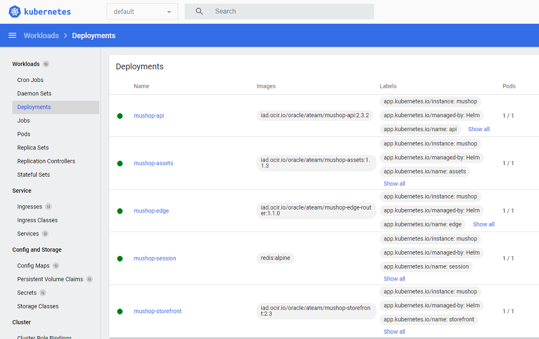
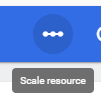

# Cluster Administration and Operations

## Introduction

In this lab you will explore some of the fundamental capabilities of Kubernetes and how to execute those common tasks within OKE. This includes:

1. Administration tasks: 
    1. Using the Kubernetes Dashboard
    2. Cluster and Node Pool Upgrades
    3. Creating and scaling node pools
    4. Leveraging Preemtible worker nodes
    5. Monitoring your cluster with OCI Logging Analytics
2. Operational tasks:
    1. Namespaces
    2. Horizontal pod scaling
    3. Perform rolling updates
    4. Rolling back an update
    5. Node Affinity (taints and tolerations)
    6. Persistent storage
    7. Working with secrets (OCI Vault and Azure Key Vault)
    8. Utilizing image pull secrets

Estimated time: 45 minutes

### Objectives

In this lab you will familiarize yourself with a variety of administration and operations activities commonly used with OKE. You may notice many of these are standard, Kubernetes functionality, there are a number of OKE-specific capabilities that make managing your Kubernetes environment a little bit easier.

## Task 1: Deploy and access the Kubernetes Dashboard

The Kubernetes dashboard is a managed add-on and can be deployed when the cluster is first created. For the sake of this workshop, we chose to walk through the process of enabling this add-on later.

### Task 1a: Enable the Kubernetes Dashboard add-on

1. Open the OCI console and navigate to **Developer Services** -> **Kubernetes Clusters (OKE)**. 

2. Locate and click the cluster you created in Lab 2.

3. Under **Resources** on the left-hand side of the screen, click *Add-ons*.

4. Click **`Manage Add-ons`** and then click the *Kubernetes dashboard* add-on. In the dialog that appears, click the checkbox to enable it. Then **`Save changes`**.

    

5. It will take about a minute to provision. When complete, it will show as `Ready` in the Add-ons table.

    

6. By default, the Kubernetes Dashboard is not publicly accessible. You would normally run `kube proxy` locally, then connect through the proxy via *localhost*. [Read more about it here](https://docs.oracle.com/en/operating-systems/olcne/1.5/orchestration/dashboard.html#dashboard)

    For this workshop, you'll expose the dashboard via LoadBalancer for ease of access. Now that the add-on setup is complete, you'll edit the service to change `spec:type` to **LoadBalancer**

    ```
    <copy>
    kubectl -n kube-system edit service kubernetes-dashborad
    </copy>
    ```

7. Scroll down to the **spec** section and locate the **type**. Press `i` to enter insert mode, then delete *ClusterIP* and replace with *LoadBalancer*.

    The save and exit process is similar to Vim: `esc` -> `:wq` -> `[Enter]`

8. It will take a minute or two to provision the OCI Load Balancer and update the service. Check it with the following command (we're ready to move forward when the `EXTERNAL-IP` becomes available):

    ```
    <copy>
    kubectl get svc -n kube-system kubernetes-dashboard
    </copy>
    ```

    The output should look like:

    ```bash
    NAME                   TYPE           CLUSTER-IP     EXTERNAL-IP     PORT(S)         AGE
    kubernetes-dashboard   LoadBalancer   10.96.87.203   129.153.68.11   443:32326/TCP   13m
    ```

9. Copy the `EXTERNAL-IP` and open a new browser window or tab. Navigate to *http://{your external IP}*.

    >Note: Because the dashboard is utilizing HTTPS and there's no SSL Certificate deployed, your browser may present a security warning. It is ok to proceed past this to the login page.

### Task 1b: Create a sample user and log into the Kubernetes Dashboard

1. Return to the other browser window with your Cloud Shell. In order to log into the Kubernetes dashboard, a token is required. You will create a service account user `dashboard-user` in the namespace `kube-system.

2. You will need to create a new manifest file named `dashboard-user` (either in Cloud Shell with Vim or Code Editor). Paste the following into the file, then save it.

    ```
    <copy>
    apiVersion: v1
    kind: ServiceAccount
    metadata:
      name: dashboard-user
      namespace: kube-system
    ---
    apiVersion: rbac.authorization.k8s.io/v1
    kind: ClusterRole
    metadata:
      name: kubernetes-dashboard-role
    rules:
      - apiGroups:
        - "*"
      resources:
        - "*"
      verbs:
        - "*"
    ---
    apiVersion: rbac.authorization.k8s.io/v1
    kind: ClusterRoleBinding
    metadata:
      name: dashboard-user
    roleRef:
      apiGroup: rbac.authorization.k8s.io
      kind: ClusterRole
      name: kubernetes-dashboard-role
    subjects:
    - kind: ServiceAccount
      name: dashboard-user
      namespace: kube-system
    </copy>
    ```

3. Apply the manifest file to your cluster.

    ```
    <copy>
    kubectl apply -f dashboard-user.yaml
    </copy>
    ```

4. Create the token for your *dashboard-user*

    ```
    <copy>
    kubectl -n kube-system create token dashboard-user
    </copy>
    ```

    The output will be a rather lengthy string that constitutes your token. Copy this and store it in a text file, just for good measure.

    

5. Return to the browser window where you opened the Dashboard web page. Ensure the **Token** radio button is selected, and paste your token in the line below.
    
    
    
6. After successfully logging in, feel free to have a look around. You will have a chance to work more in the Dashboard during later labs.

    

    >Note: The Kubernetes dashboard will only keep the login session open for a short time, after which you will be logged out. Unfortunately, when your login session expires the Kubernetes dashboard doesn't always return you to the login screen. If you find that you are making changes and the dashboard doesn't reflect them, or that you can see something using kubectl - but not in the dashboard, or you trigger an action on the dashboard (e.g. switching to a different a namespace) but the content doesn't update, it's probable that the session has expired. In this case, reload the web page or go to the login URL (above), this will reset the pages state and present you with the login screen again, login using your token as previously (the token does not change, so you don't have to extract it again)

## Task 2: Manually scaling an existing deployment
Microservices should be designed to scale horizontally; that is, pods are added or removed to meet the requirements of the application. We'll cover auto scaling in the next lab. For now, take a look at the process for adding or removing pods manually.

Why would you want to scale manually? Generally this is done for testing purposes - you may want to know how the application will perform with a certain number of pods (baseline performance / max capacity / etc). You might also want to test your application to see how it will handle the unexpected evacuation of a pod. Certainly you designed you app to handle such things...but let's just be certain!

1. Open the Kubernetes dashboard (if its been more than 15 minutes since you completed the last lab, you may need to log in again). In the left menu under the **Workloads** section choose **Deployments**.

    

    While you can go directly to the Replica sets page, it's worth noting how the two are connected.

    You should see the 5 deployments here that were created when MuShop was deployed earlier.

2. Click the `mushop-storefront` deployment for more details.

    

3. After perusing the details of this deployment, scroll down and locate the **Replica sets** section.

    

    In the **New Replica Set** section you can see details of the current replica set. There is nothing in the **Old Replica Set** section because no rolling updates have been applied. We'll get to that later.

4. In the **New Replica Set** section, click on the replica set name to view more details.

    

    In the **Pods** section you'll notice that there is 1 pod runnign out of 1 desired.

5. Return to the mushop-storefront deployment and click the ``Scale resources`` button in the top right corner.

    

6. In the popup, set the desired number of pods to 3, then click the **Scale** button.

    

7. Kubernetes acts quickly to add the additional pods. You should see this reflected in the **Pod status**

8. You can also confirm the number of pods in Cloud Shell (after switching back to the approprate browser window / tab)...before scaling back in.

    ```
    <copy>
    kubectl get deployment mushop-storefront
    </copy>
    ```

    ```bash
    NAME                READY   UP-TO-DATE   AVAILABLE   AGE
    mushop-storefront   3/3     3            3           4h25m
    ```

9. While in Cloud Shell, execute the following command to return to a single replica.

    ```
    <copy>
    kubectl scale deployment mushop-storefront --replicas=1
    </copy>
    ```

    ```bash
    $ kubectl scale deployment mushop-storefront --replicas=1
    deployment.apps/mushop-storefront scaled
    $ kubectl get deployment mushop-storefront
    NAME                READY   UP-TO-DATE   AVAILABLE   AGE
    mushop-storefront   1/1     1            1           4h29m
    ```

10. That's it! You're ready to move on to the next task.

<detail><summary><b>Why scale the deployment and not the replica set?</b></summary>
Kubernetes technically supports scaling on the replica set as well as the deployment, however what actually controls the scaling is the replication controller. If you try and change the number of replicas directly in the replica set it will (briefly) make the change.

Unfortunately the replication controller that is connected to the deployment doesn't pick up on changes to the replica set, only to the deployment, so the deployment replication controller will recognize the change in pods and will immediately try and correct the situation and revert the change.
---
</detail>


## Task 3: Working with Cluster Auto scaling
You can use the Kubernetes Cluster Autoscaler to automatically resize a cluster's managed node pools based on application workload demands. By automatically resizing a cluster's node pools, you can ensure application availability and optimize costs.

The Kubernetes Cluster Autoscaler is a standalone program that:

* Adds worker nodes to a node pool when a pod cannot be scheduled in the cluster because of insufficient resource constraints.
* Removes worker nodes from a node pool when the nodes have been underutilized for an extended time, and when pods can be placed on other existing nodes.

<detail><summary><b>Additional information: Kubernetes Cluster Autoscaler</b></summary>

The Kubernetes Cluster Autoscaler increases or decreases the size of a node pool automatically based on resource requests, rather than on resource utilization of nodes in the node pool.

The Kubernetes Cluster Autoscaler works on a per-node pool basis. You use a configuration file to specify which node pools to target for expansion and contraction, the minimum and maximum sizes for each node pool, and how you want the autoscaling to take place. Node pools not referenced in the configuration file are not managed by the Kubernetes Cluster Autoscaler.

To enable the Kubernetes Cluster Autoscaler to automatically resize a cluster's node pools based on application workload demands, always include resource request limits in pod specifications (requests: under resources:).

---
</detail>


Instructions here

## Task 3: Create a logging namespace

...

## Task 4: Scaling your deployment with a new replica set

...

## Task 5: Rolling back a deployment update

...

Create a secret in OCI Vault and another in Azure Key Vault (maybe).

## Task 8: Create and utilize an imagePullSecret

...


## Acknowledgements

* **Author** - 
* **Contributors** -
* **Last Updated By/Date** - 