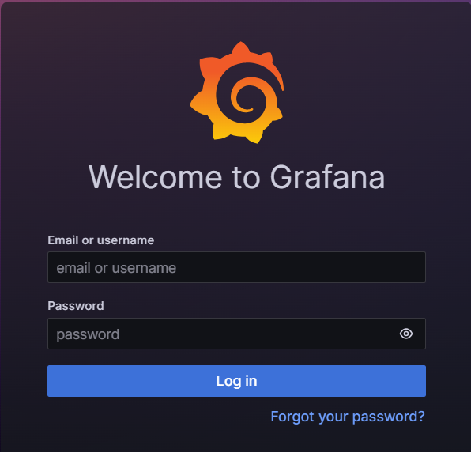

# Install monitoring with Prometheus

## Introduction

This lab will illustrate how to setup a cloud native monitoring stack on Oracle Container Engine for
Kubernetes (OKE). The stack is based on the popular Prometheus and Grafana toolchain which can provide
both cluster monitoring as well as application and infrastructure monitoring. The setup is based on the
Prometheus community driven project [kube-prometheus](https://github.com/prometheus-operator/kube-prometheus).

**Estimated module duration** 20 mins.

### Objectives

Install Prometheus and Grafana, then interact with the Grafana dashboard to view metrics within your OKE Cluster.

### Prerequisites

A general understanding of monitoring in Kubernetes...as outlined below.

Monitoring a service in Kubernetes involves three components

**A. Generating the monitoring data**
This is mostly done by the service itself, the metrics capability we created when building the Helidon labs are an example of this.

Core Kubernetes services may also provide the ability to generate data, for example the Kubernetes DNS service can report on how many lookups it's performed.

**B. Capturing the data**
Just because the data is available doesn't mean we can analyse it, something needs to extract it from the services, and store it. 

**C. Processing and Visualizing the data**
Once you have the data you need to be able to process it to visualize it and also report any alerts of problems.


## Task 1: Installing Prometheus

For this lab we are going to do some very simple monitoring, using the metrics in our microservices and the standard capabilities in the Kubernetes core services to generate data.  Then we'll use the Prometheus tool to extract the data and Grafana to display it.

These tools are of course not the only ones, but they are very widely used, and are available as Open Source projects.

1. The default installation of the kube-prometheus stack does not use persistent storage and therefore the collected metrics will be lost if the pods are restarted. To overcome this, you can customize the values.yaml passed to the helm chart, with added storage configuration.

Create a new file named values-oci.yaml.

  ```
  <copy>
  prometheus:
    prometheusSpec:
      storageSpec:
        volumeClaimTemplate:
          spec:
            storageClassName: oci-bv
            accessModes: ["ReadWriteOnce"]
            resources:
              requests:
                storage: 50Gi

  </copy>
  ```

2. Now add the Helm repo and update the charts.

  ```
  <copy>
  helm repo add prometheus-community https://prometheus-community.github.io/helm-charts && helm repo update
  </copy>
  ```

3. Create a new Kubernetes namespace for the monitoring stack.

  ```
  <copy>
  kubectl create namespace monitoring
  </copy>
  ```

4. Install the chart using the values.yaml created in step 1.

  ```
  <copy>
  helm install kube-prometheus-stack --namespace monitoring -f values.yaml prometheus-community/kube-prometheus-stack
  </copy>
  ```

5. Once the installation is complete, the `kube-prometheus-stack-grafana` service will need to be exposed to the public internet. Time to edit the service and change a few things. (similar to what was done when deploying the K8s dashboard in lab 5)

  ```bash
  <copy>
  kubectl -n monitoring edit svc kube-prometheus-stack-grafana
  </copy>
  ```

6. Type **`i`** to enter *insert* mode and change the `spec.type:` to **LoadBalancer**. Then scroll back up to the `metadata.annotations:` section and paste the following:

  ```bash
  <copy>
    oci.oraclecloud.com/load-balancer-type: lb
    service.beta.kubernetes.io/oci-load-balancer-shape: flexible
    service.beta.kubernetes.io/oci-load-balancer-shape-flex-max: "100"
    service.beta.kubernetes.io/oci-load-balancer-shape-flex-min: "10"
  </copy>
  ```

  It should look something like this - make sure spacing is correct:

  ```bash
  apiVersion: v1
  kind: Service
  metadata:
    annotations:
      meta.helm.sh/release-name: kube-prometheus-stack
      meta.helm.sh/release-namespace: monitoring
      oci.oraclecloud.com/load-balancer-type: lb
      service.beta.kubernetes.io/oci-load-balancer-shape: flexible
      service.beta.kubernetes.io/oci-load-balancer-shape-flex-max: "100"
      service.beta.kubernetes.io/oci-load-balancer-shape-flex-min: "10"
  ```

7. Exit and save to apply changes to the service. It will take 1-2 minutes for the Load Balancer to be created.

8. Retrieve the external IP address for the stack.

  ```bash
  kubectl -n monitoring get svc
  ```

9. You may now open another browser tab and navigate to http://{EXTERNAL-IP}. You should land no:

  

  ...but wait...where are my credentials?

  I'm glad you asked...

10. During the deployment, a default password was created and stored as a Kubernetes secret. To retrieve it, run the following command in Cloud Shell.

  ```bash
  <copy>
  kubectl get secret kube-prometheus-stack-grafana -o jsonpath="{.data.admin-password}" -n monitoring | base64 --decode;echo
  </copy>
  ```

  ...ok, I have the password...what is the username?

  Another excellent question! The username will be **admin**

11. Return to the Grafana logon page and enter your newfound credentials.

## Task 2: View pre-installed Dashboards.

Now that Grafana and Prometheus are running, you'll have access to a broad array of metrics within your Kubernetes environment. If you're familiar with Grafana, you may opt to jump right in and create your own dashboard. On the other hand...a number of pre-built dashboards are included in the stack. Let's take a look.

1. Click the hamburger menu in the top left corner of the home page. Then click **`Dashboards`**.

  

2. Click the **General** folder to expand the list of pre-installed dashboards.

3. Pick one that seems of interest to you and click the name.  *Voila!* You're immediately transported to the dashboard.

## Task 3: Import custom or 3rd party dashboards

There are some additional samples made available on Grafana.com. The following is a quick set of instructions on how to load those into your recent Grafana deployment.

1. Click the **`+ ^`** in the top right corner of the Grafana main page. The click **Import dashboard**.

  

2. In the **Import via grafana.com** field, enter `19105`, then click **`[Load]`**.

3. Select your Prometheus data source (was automatically installed with the stack).

  

4. Click **`[Import]`** and behold - your new dashboard!

5. Peruse the additional list of dashboards available and import as you like.

  Grafana.com dashboard id list:

  | Dashboard                          | ID    |
  |:-----------------------------------|:------|
  | k8s-addons-prometheus.json         | 19105 |
  | k8s-addons-trivy-operator.json     | 16337 |
  | k8s-system-api-server.json         | 15761 |
  | k8s-system-coredns.json            | 15762 |
  | k8s-views-global.json              | 15757 |
  | k8s-views-namespaces.json          | 15758 |
  | k8s-views-nodes.json               | 15759 |
  | k8s-views-pods.json                | 15760 |


## End of the module, what's next ?

You may continue on to one of the following activities:

* **Optional** [Lab 6c: Encrypting volumes with Customer Managed Keys (in OKE)](https://oracle-devrel.github.io/oci-oke-zero-to-day-two-ops/livelabs/ocw23-freetier/index.html?lab=sec-data_encryption)
* **Optional** [Automating OKE App Deployment with OCI DevOps](https://oracle-devrel.github.io/oci-oke-zero-to-day-two-ops/livelabs/ocw23-freetier/index.html?lab=devops)
* **Optional** ...but highly recommended - [Cleaning up your tenancy](https://oracle-devrel.github.io/oci-oke-zero-to-day-two-ops/livelabs/ocw23-freetier/index.html?lab=cleanup)

## Acknowledgements

* **Author** - Jeevan Joseph, Sr. Principal Product Manager
* **Contributor** - Eli Schilling, Developer Advocate
* **Last Updated By** - Eli Schilling, August 2023