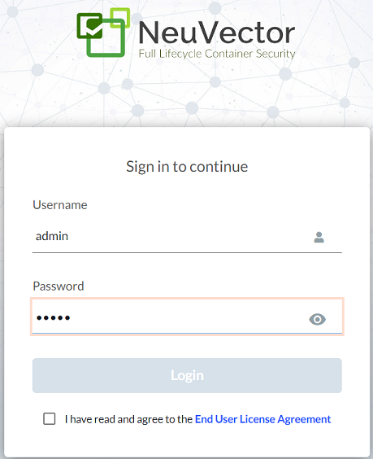
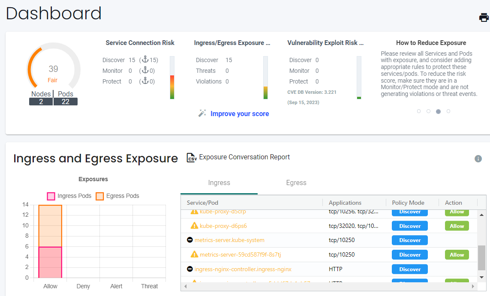
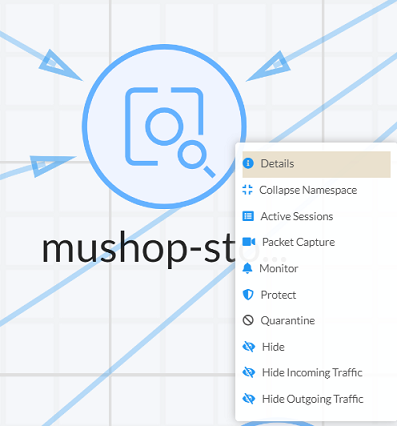
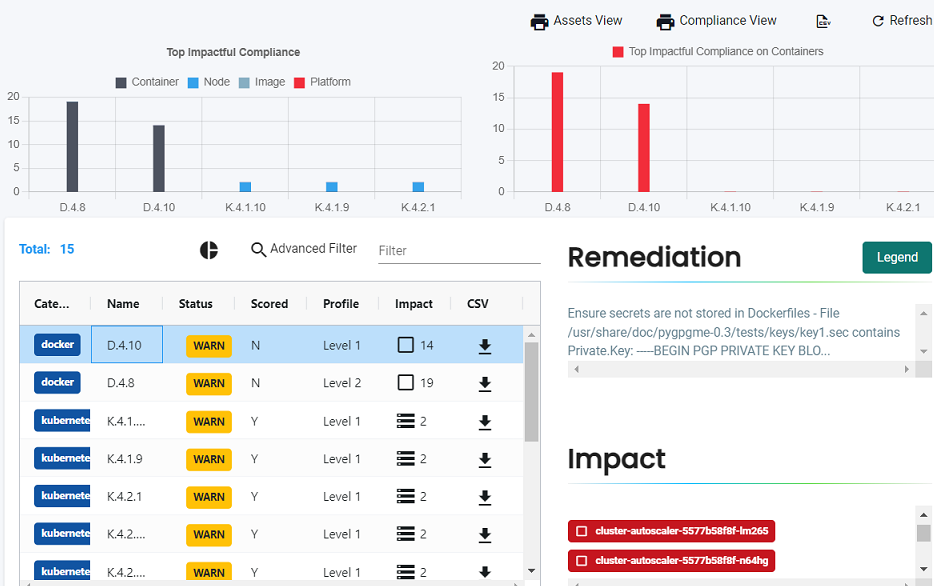

# Introduction

## About this workshop.

Vulnerability management, compliance, and runtime security are critical components to factor into your environment. In this lab you'll explore the capabilities of an open source tool called **Neuvector** as a means to integrate zero trust into your containerized workflows. You'll also take a look at Cosign, another open source tool that provides software artifact signing, verification, and storage in an Open Container Initiative registry.

### Objectives

In this lab, you will:

* Deploy Neuvector and explore the toolset
* Deploy Cosign and sign a container image


## Task 1: Install Neuvector

To simplify the installation, a Kubernetes manifest has been created for you (in the resources folder). If you would like to dig deeper, you can [review the docs](https://github.com/neuvector/neuvector-operator/blob/master/docs/NeuVectorDeployKubernetes.md) maintained by Neuvector.

1. Create a new namespace:

    ```bash
    <copy>kubectl create ns neuvector</copy>
    ```

2. Apply the provided Kubernetes manifest.

    ```bash
    <copy>kubectl create -f resources/neuvector.yaml<copy>
    ```

3. Check to ensure all pods have been created successfully. Do not proceed until everything is *running*:

    ```bash
    <copy>kubectl -n neuvector get pods</copy>
    ```

4. Obtain the external IP address for the Neuvector service:

    ```bash
    <copy>kubectl -n neuvector get svc
    ```

    ```console
    eli_devrel@cloudshell:~ (us-phoenix-1)$ kubectl -n neuvector get svc
    NAME                              TYPE           CLUSTER-IP     EXTERNAL-IP     PORT(S)                         AGE
    neuvector-service-webui           LoadBalancer   10.96.59.249   144.24.27.143   8443:32174/TCP                  36s
    neuvector-svc-admission-webhook   ClusterIP      10.96.137.87   <none>          443/TCP                         36s
    neuvector-svc-controller          ClusterIP      None           <none>          18300/TCP,18301/TCP,18301/UDP   36s
    neuvector-svc-crd-webhook         ClusterIP      10.96.7.112    <none>          443/TCP                         36s
    ```

5. Open a new browser tab to `https://{EXTERNAL-IP}:8443`. Because we don't have a TLS cert, you'll get the insecure connection warning again.  Click Advanced and Proceed:

    

    > NOTE: To log into the console, enter `admin` for both *username* and *password*

## Task 2: Take a look around the Neuvector console

Take a few minutes to look around the console. The following are just a few recommendations.

1. Scroll down through the dashboard for high-level summary details:

    

2. Click on Network Activity to see a diagram of your containerized environment. Right click on any of the pods to see available actions.

    

3. Click the **`Security Risks`** menu and then click **`Compliance`**. You can explore the compliance warnings that were detected by the tool. Up at the top of the page you'll notice a few options to print detailed reports:

    

Thats it for Neuvector for now. Feel free to check it out more later when you have some spare time. Let's move on to Cosign.

## [Optional] Task 3: Install Cosign and sign a container image

Cosign is an open source tool used to enforce securitiy of container images through the process of signing. It does require a client be installed locally in order to execute the necessary tasks. For that reason, you would need to either complete this task on your own laptop, or provision an OCI Compute Instance and run it there. You will need to have Docker installed and retrieve the username and auth token gathered in Lab 2.

1. Visit [this page](https://github.com/sigstore/cosign/releases) to download the latest version of Cosign that corresponds to your client.

2. Install the Cosign package (in this example we're using Oracle linux):

    ```bash
    <copy>
    sudo rpm -ivh cosign-1.8.0.x86_64.rpm
    </copy>
    ```

3. Once installed, generate a new key pair to be used for image signing:

    ```bash
    <copy>
    cosign generate-key-pair
    </copy>
    ```

    > NOTE: You will be prompted to enter a password or the private key. You *may* simply press `[Enter]` twice to leave the password blank. Though we all know you'd **_never_** do this in production.

    ```bash
    [opc@bastion ~]$ cosign generate-key-pair
    Enter password for private key:
    Enter password for private key again:
    Private key written to cosign.key
    Public key written to cosign.pub
    ```

4. Retrieve an image from Dockerhub that can be used to test the signing process:

    ```bash
    <copy>docker pull alpine:latest</copy>
    ```

5. Tag the image in order to then push it to the OCI Container Registry:

    ```bash
    <copy>docker tag alpine:latest phx.ocir.io/abc123def456/cosign-activity:latest</copy>
    ```
    
    > NOTE: Be sure to input the correct region identifier and Tenancy namespace. For a quick refresher, refer to **Lab 4** --> **Task 2**.

6. Run the `docker login` command to authenticate to OCIR, making sure to replace `phx` with your chosen region key. When prompted, enter your full username (tenancy namespace/username) and password:

    ```bash
    <copy>docker login phx.ocir.io</copy>
    ```

7. When you run the next command, OCIR will automatically create a new image repo in the *root* compartment. This is by design, as Docker is aware of the Compartment structure in OCI. If, however, you create a new repo first in the desired compartment, the `push` command will place your image in the correct repo/compartment:

    ```bash
    <copy>docker push phx.ocir.io/abc123def456/cosign-activity:latest</copy>
    ```

    ```console
    [opc@bastion ~]$ docker push phx.ocir.io/abc123def456/cosign-activity
    Getting image source signatures
    Copying blob b2191e2be29d done
    Copying config f6648c04cd done
    Writing manifest to image destination
    Storing signatures
    ```

8. Before proceeding, let's run a quick test just to see what it looks like when we try to verify an unsigned image. Run the verify command:

    ```bash
    <copy>cosign verify --key cosign.pub phx.ocir.io/abc123def456/cosign-activity:latest --insecure-ignore-tlog</copy>
    ```

    You should see the following output:

    ```bash
    [opc@bastion ~]$ cosign verify --key cosign.pub phx.ocir.io/abc123def456/cosign-activity:latest --insecure-ignore-tlog
    WARNING: Skipping tlog verification is an insecure practice that lacks of transparency and auditability verification for the signature.
    Error: no matching signatures
    main.go:69: error during command execution: no matching signatures
    ```

9. Sign the image with the private key created earlier (This would normally be utilized as part of the build process):

    ```bash
    <copy>cosign sign --key cosign.key phx.ocir.io/abc123def456/cosign-activity:latest --tlog-upload=false</copy>
    ```

    > NOTE: The sigstore service utilizes a transparency log for tracking repos. In this instance, we're using a private, test repo, so there's no need to append to the log. Adding `--tlog-upload=false` bypassess the check. Of course, in production, you'd want to make sure your repo is part of the transparency log.

    ```bash
    [opc@bastion ~]$ cosign sign --key cosign.key phx.ocir.io/abc123def456/cosign-activity --tlog-upload=false
    Enter password for private key:
    WARNING: Image reference phx.ocir.io/axhc9zgtyjst/cosign-activity uses a tag, not a digest, to identify the image to sign.
    This can lead you to sign a different image than the intended one. Please use a
    digest (example.com/ubuntu@sha256:abc123...) rather than tag
    (example.com/ubuntu:latest) for the input to cosign. The ability to refer to
    images by tag will be removed in a future release.

    Pushing signature to: phx.ocir.io/axhc9zgtyjst/cosign-activity
    ```

10. Now verify with the public key to ensure your image was not altered since you last stored it:

    ```bash
    <copy>cosign verify--key cosign.pub phx.ocir.io/abc123def456/cosign-activity:latest --insecure-ignore-tlog</copy>
    ```

    ```bash
    [opc@bastion ~]$ cosign verify --key cosign.pub phx.ocir.io/axhc9zgtyjst/cosign-activity:latest --insecure-ignore-tlog
    WARNING: Skipping tlog verification is an insecure practice that lacks of transparency and auditability verification for the signature.

    Verification for phx.ocir.io/axhc9zgtyjst/cosign-activity:latest --
    The following checks were performed on each of these signatures:
      - The cosign claims were validated
      - The signatures were verified against the specified public key

    [{"critical":{"identity":{"docker-reference":"phx.ocir.io/axhc9zgtyjst/cosign-activity"},"image":{"docker-manifest-digest":"sha256:281f21211c6ff26f15f7fe80f69f772579d5fd695e0706edcbc24abfc621fdae"},"type":"cosign container image signature"},"optional":null}]
    ```

    > NOTE: Again, because we are doing this on a trial basis, we'll avoid checking the transparency log (where we know there's no entry for our repo) and just confirm that the image was signed. Append `--insecure-ignore-tlog` to make this happen

You may now **proceed to the next lab**.

## Learn More

* [Neuvector Documentation](https://github.com/neuvector/docs)
* [Sigstore / Cosign Documentation](https://docs.sigstore.dev/signing/quickstart/)


## Acknowledgements

* **Author** - Eli Schilling - Developer Advocate
* **Contributors** - Chip Hwang - Sr. Principal Tech Marketing Engineer
* **Last Updated By/Date** - September 2023
