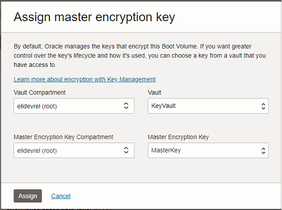

# Dynamic Volume Provisioning with Customer-Managed Keys for Data Encryption

## Introduction

Data encryption-at-rest in the Oracle Cloud Infrastructure (OCI) has been addressed at all levels. Data encryption-at-rest is used in a plethora of security solutions and options: it provides data encryption that prevents unauthorized users from accessing data. Any such data leak can result in financial penalties, and/or criminal lawsuits that can run ruin company's reputation.

OCI security initiative implements a "ubiquitous encryption" program to encrypt all data, everywhere. When not specified, the Block Volumes and Object Storage services enable at-rest data encryption by default -- using Oracle-managed encryption keys -- by using the Advanced Encryption Standard (AES) algorithm with 256-bit encryption. However, there might be situations where customers are required to manage their own keys for greater compliance or governance reason.

OCI empowers its customers to use their own encryption keys for data encryption. The same keys can be used in OKE to dynamically provision Storage Volumes, which are encrypted using the customer-managed keys. This relieves the need for customers to re-encrypt the dynamically-allocated storage volumes with customer-managed keys. The purpose of this blog is to lay out the steps, in detail, required to allow Oracle Kubernetes Engine (OKE) to dynamically provision the block volumes, as requested by the application, using data encryption with customer managed-keys in OCI vault.

Estimated time: 20 minutes

### Objectives

* Create a Vault and customer master encryption key
* Create the necessary IAM policies
* Define a new storage class in Kubernetes
* Provision an encrypted block volume via PVC

## Task 1: Create Vault and Master Encryption Key

1. From the OCI Console, navigate to **Identity & Security** -> **Vault**.

2. Click **`Create Vault`**.

3. Select the desired compartment (*root* unless you've created a compartment specifically for this workshop) and name your vault:

    

    <details><summary><b>Additional Information on OCI Vault</b></summary>

    All vault types ensure the security and integrity of the encryption keys and secrets that vaults store. A virtual private vault is an isolated partition on a hardware security module (HSM). Otherwise, Vaults share partitions on the HSM with other vaults. Virtual Private Vault comes with a higher price tag, so I'll skip that option for this demo.

    Once the Vault is successfully created, it's time to create customer-managed encryption keys for data encryption. Create a key as follows. The customers have the option to import their key into the OCI Vault as well.

    ---

    </details>

4. Once the Vault has successfully been created, click the name of the Vault. Within the **Master Encryption Keys** area, click **`Create Key`**.

5. Provide a name for the key, leaving all other settings as default:

    

6. Once the new key has been created, click the name of the key to view details. Copy the OCID of the key for use in a later step.

## Task 2: Create Identity and Access Management Policy

Before the Master Key can be used by any of the OCI services, appropriate IAM policies are required to ensure authorized usage by the back-end services. 

1. To create a new IAM policy, navigate to the main menu, then click **Identity & Security** -> **Identity** -> **Policies**.

    > Note: The policy can be created in the *root* compartent where it will be inhereited by all child compartments. If desired, you can create the policy in the compartment where the specific application is deployed in order to limit the scope of the policy.

2. Click **`Create Policy`**.

3. Provide a name and description for the policy.

4. Click the slide button for *Show manual editor* and paste the following policy statements.

    **For root compartment:**
    
    ```
    <copy>
    Allow service blockstorage to use keys in tenancy where target.key.id = '<paste key OCID here>'
    Allow any-user to use key-delegates in tenancy where ALL {request.principal.type = 'cluster', target.key.id = '<paste key OCID here>'}
    </copy>
    ```

    

    **For user-created compartment:**

    ```
    <copy>
    Allow service blockstorage to use keys in compartment <your compartment name> where target.key.id = '<paste key OCID here>'
    Allow any-user to use key-delegates in compartment <your compartment name> where ALL {request.principal.type = 'cluster', target.key.id = '<paste key OCID here>'}
    </copy>
    ```

5. You're all done with IAM Policies. Time to move on to the next task.

## Task 3: Creating encrypted storage

By default, OKE creates two Storage Classes for dynamic volume provisioning. However, both classes use the Oracle-managed keys for storage encryption which is the default in the OCI ecosystem:

```bash
kubectl get storageclasses
NAME                     PROVISIONER                       RECLAIMPOLICY   VOLUMEBINDINGMODE      ALLOWVOLUMEEXPANSION   AGE
oci                      oracle.com/oci                    Delete          Immediate              false                  3d21h
oci-bv (default)         blockvolume.csi.oraclecloud.com   Delete          WaitForFirstConsumer   true                   3d21h
```

1. Open Cloud Shell and Code Editor for this next section. You can choose between several different view options -- my recommendation would be to use the stacked view:

    

2. Use the file menu in Code Editor to create a new file. Name it `storage-class.yaml`:

    

    > Note: The default location is your Cloud Shell home directory.

3. Paste the following code then save the file:

    ```yaml
    <copy>
    apiVersion: storage.k8s.io/v1
    kind: StorageClass
    metadata:
    annotations:
    storageclass.kubernetes.io/is-default-class: "true"
    name: customer-key
    provisioner: blockvolume.csi.oraclecloud.com
    parameters:
    attachment-type: "paravirtualized"
    kms-key-id: "<your master key OCID here>"
    reclaimPolicy: Delete
    allowVolumeExpansion: true
    volumeBindingMode: WaitForFirstConsumer
    </copy>
    ```

4. Validate the file in Cloud Shell:

    

5. Apply the configuration to your OKE cluster:

    ```bash
    <copy>kubectl apply -f storage-class.yaml</copy>
    ```

    

6. *(Optional)* View the 3 storage classes:

    ```bash
    $ kubectl get storageclass
    NAME                     PROVISIONER                       RECLAIMPOLICY   VOLUMEBINDINGMODE      ALLOWVOLUMEEXPANSION   AGE
    customer-key (default)   blockvolume.csi.oraclecloud.com   Delete          WaitForFirstConsumer   true                   96s
    oci                      oracle.com/oci                    Delete          Immediate              false                  33d
    oci-bv (default)         blockvolume.csi.oraclecloud.com   Delete          WaitForFirstConsumer   true                   33d
    ```

7. Create a Persistent Volume Claim using the new storage class.

    <details><summary><b>Persistent Volumes</summary></b>

    A *PersistentVolumeClaim (PVC)* is a request for storage by a user. It is similar to a Pod. Pods consume node resources and PVCs consume PV resources. Pods can request specific levels of resources (CPU and Memory). Claims can request specific size and access modes (e.g., they can be mounted ReadWriteOnce, ReadOnlyMany, or ReadWriteMany).

    A *PersistentVolume (PV)* is a piece of storage in the cluster that has been provisioned by an administrator or dynamically provisioned using Storage Classes. It is a resource in the cluster just like a node is a cluster resource. PVs are volume plugins like Volumes, but have a lifecycle independent of any individual Pod that uses the PV.
    
    ---

    </details>

    ```bash
    <copy>
    cat << EOF | kubectl apply -f - 
    apiVersion: v1
    kind: PersistentVolumeClaim
    metadata:
    name: nginx-pvc
    spec:
    storageClassName: "customer-key"
    accessModes:
        - ReadWriteOnce
    resources:
        requests:
        storage: 50Gi
    EOF
    </copy>
    ```

8. Check the status of the Persistent Volume Claim (PVC). The status of the persistent volume is pending and will get provisioned the moment a new application requests the use of PVC:

    ```bash
    $ kubectl get pvc
    NAME        STATUS    VOLUME   CAPACITY   ACCESS MODES   STORAGECLASS   AGE
    nginx-pvc   Pending                                      customer-key   14s
    ```

9. Let's deploy an application and verify that the dynamic volume provisioning creates a volume that is managed by the customer-managed keys for data encryption at rest:

    ```bash
    <copy>
    cat << EOF | kubectl apply -f -
    apiVersion: v1
    kind: Pod
    metadata:
    name: nginx-with-storage
    spec:
    containers:
        - name: nginx-with-storage
        image: nginx:latest
        ports:
            - name: http
            containerPort: 80
        volumeMounts:
            - name: data
            mountPath: /usr/share/nginx/html
    volumes:
        - name: data
        persistentVolumeClaim:
            claimName: nginx-pvc
    EOF
    </copy>
    ```

10. Wait a minute or two for the volume to get created, then check the PVC once more:

    ```bash
    $ kubectl get pvc
    NAME        STATUS   VOLUME                                     CAPACITY   ACCESS MODES   STORAGECLASS   AGE
    nginx-pvc   Bound    csi-dacfdfd5-454a-463b-8587-3ba22da549b5   50Gi       RWO            customer-key   1m30s
    ```

11. Now check the status of the Block Volume to see what was created. Navigate via the main menu to **Storage** -> **Block Volumes**. Click the name of the block volume to view details:

    

    > Note: Notice that the Encryption key used to encrypt the block volumes is the same that was specified earlier when creating the storage class.

12. *(Optional)* You may also choose to encrypt the OKE worker nodes boot volumes using customer-managed keys.

    Since the required IAM policies are already in-place for the Block Volume service to use the encryption key from the Vault, we can leverage the same policies to encrypt/re-encrypt the Boot Volumes using the customer-managed keys as well. 

    Navigate to **Block Storage** -> **Boot Volumes** and locate the worker node boot volumes associated with your OKE Cluster.

13. Open the boot volume, click the `Assign` link next to the **Encryption key** property:

    

14. Select the Vault and Master Key that you created earlier, then click **`Assign`**:

    

    > Note: It will take a couple of seconds to update the volume, at which time it will use your customer-managed key for encryption.

## Task 4: Clean Up

With a few quick commands you'll delete the pod and PVC to remove the resources that were deployed during this activity.

1. In Cloud Shell, run the following to delete the pod:

    ```bash
    <copy>kubectl delete pod nginx-with-storage</copy>
    ```

2. Then run the following to delete the PVC (which will also remove the Block Volume resource):

    ```bash
    <copy>kubectl delete pvc nginx-pvc</copy>
    ```

3. In the OCI Console, navigate to **Identity & Security** -> **Vault** and delete the Vault you created earlier.

    > Note: It will prompt for a deletion date with a default of 1 month in the future. You may change the date to be as early as 1 week in the future.

4. That's it, you're all set to move forward.

## Conclusion

Oracle Kubernetes Engine (OKE) is highly flexible and allows users to encrypt the dynamically-provisioned volumes with their own keys. Any key rotation operations performed on the Master Encryption Key do not require the modification of the Storage Class already created.

You may now **proceed to the next lab**.

## Acknowledgements

* **Author** - Farooq Nafey, Principal Cloud Architect 
* **Contributors** - Eli Schilling, Developer Advocate
* **Last Updated By/Date** - Eli Schilling / 19-July-2023


