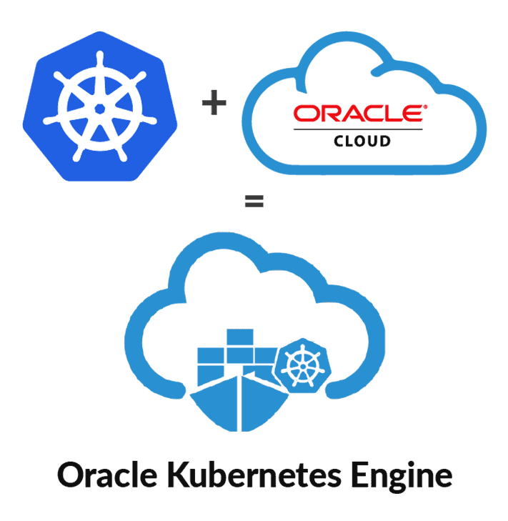

# Introduction

## A Deep Dive into Kubernetes using OKE - From Zero to Day 2 Operations

## About this workshop.

...

Estimated time: 4 hours

### Objectives

In this lab, you will:

* Provisioning Infrastructure using IaC and OCI Resource Manager.
* ...
* ...
* Clean up the infra.

### Prerequisites

1. An Oracle Free Tier(Trial), Paid or LiveLabs Cloud Account
1. [Familiarity with OCI console](https://docs.us-phoenix-1.oraclecloud.com/Content/GSG/Concepts/console.htm)
1. [Familiarity with the basics of Kubernetes](https://kubernetes.io/docs/tutorials/kubernetes-basics/)
1. [Overview of Networking](https://docs.us-phoenix-1.oraclecloud.com/Content/Network/Concepts/overview.htm)
1. 

## Cloud Native Applications Overview

"Cloud native technologies empower organizations to build and run scalable applications in modern, dynamic environments such as public, private, and hybrid clouds. Containers, service meshes, microservices, immutable infrastructure, and declarative APIs exemplify this approach.

These techniques enable loosely coupled systems that are resilient, manageable, and observable. Combined with robust automation, they allow engineers to make high-impact changes frequently and predictably with minimal toil."

## Kubernetes Basics - Summary

You may now **proceed to the next lab**.

## Learn More

* [Reference Architecture: Understand modern app deployment strategies with Oracle Cloud Infrastructure DevOps ](https://docs.oracle.com/en/solutions/mod-app-deploy-strategies-oci/index.html)

## Acknowledgements

* **Author** - 
* **Contributors** -
* **Last Updated By/Date** - 